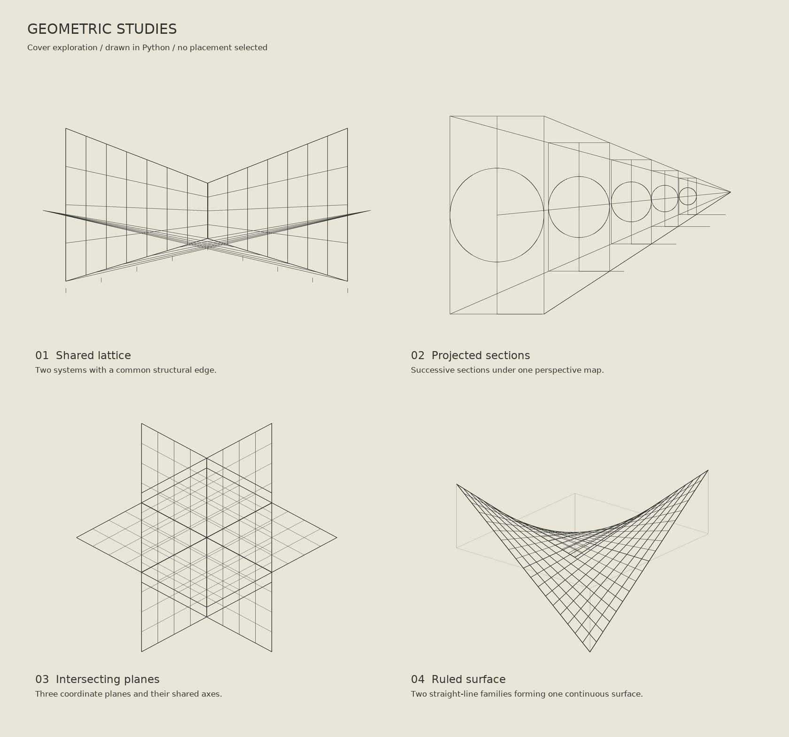

# Geometric cover studies

Design drafts for the Safety–Capability Coupling Program cover.
No study has been placed in the document. The selected direction is the original
option 02, with only its ovals changed to true circles. Its boxes, projection lines,
centers and spacing are unchanged. The alternate circular-sequence and common-chord
compositions were rejected and removed; do not use them for further development.

| Study | Construction | Vector source |
|---|---|---|
| 01 Shared lattice | Two planar lattices with a common edge and crossing projection rays | [SVG](shared_lattice.svg) |
| 02 Projected sections | Circular sections with the original boxes and projection lines | [SVG](projected_sections.svg) |
| 03 Intersecting planes | Three coordinate planes in an axonometric projection | [SVG](intersecting_planes.svg) |
| 04 Ruled surface | The surface z = xy, drawn using its two families of straight lines | [SVG](ruled_surface.svg) |

The supplied perspective illustrations inform the line weight, construction
geometry and paper palette. These are aesthetic studies, not scientific figures
or representations of an established SCC mechanism. SVG backgrounds are transparent;
PNG previews use a warm paper background. No image-generation model was used.

Rebuild with [the Python drawing source](../../scripts/render_geometric_studies.py),
using Pillow and the ReportLab font files already used by the document renderer.
