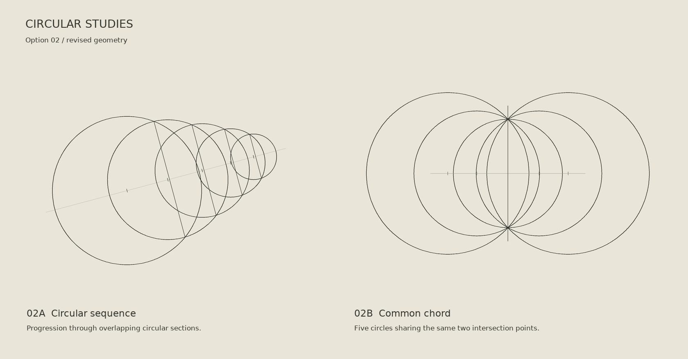

# Geometric cover studies

Design drafts for the Safety–Capability Coupling Program cover.
No study has been placed in the document. The selected direction is option 02,
revised below with circular geometry and independent compositions. The references
set line quality and visual restraint, rather than a composition to reproduce.

## Circular revisions

| Study | Construction | Vector source |
|---|---|---|
| 02A Circular sequence | Five overlapping true circles; adjacent intersections define transverse chords | [SVG](circular_sequence.svg) |
| 02B Common chord | Five true circles sharing two intersection points | [SVG](common_chord.svg) |

Rebuild these revisions with [the circular drawing source](../../scripts/render_circular_studies.py).

## Initial studies

| Study | Construction | Vector source |
|---|---|---|
| 01 Shared lattice | Two planar lattices with a common edge and crossing projection rays | [SVG](shared_lattice.svg) |
| 02 Projected sections | Parallel elliptical sections under a central projection | [SVG](projected_sections.svg) |
| 03 Intersecting planes | Three coordinate planes in an axonometric projection | [SVG](intersecting_planes.svg) |
| 04 Ruled surface | The surface z = xy, drawn using its two families of straight lines | [SVG](ruled_surface.svg) |

The supplied perspective illustrations inform the line weight, construction
geometry and paper palette. These are aesthetic studies, not scientific figures
or representations of an established SCC mechanism. SVG backgrounds are transparent;
PNG previews use a warm paper background. No image-generation model was used.

Rebuild with [the Python drawing source](../../scripts/render_geometric_studies.py),
using Pillow and the ReportLab font files already used by the document renderer.
