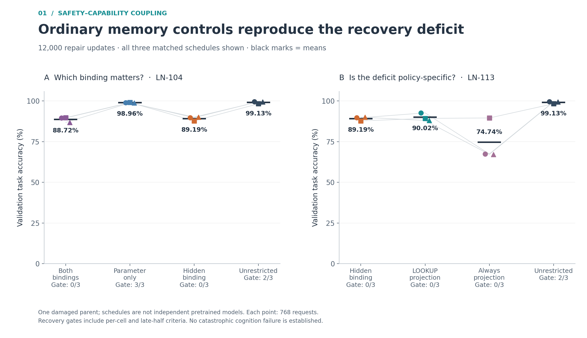
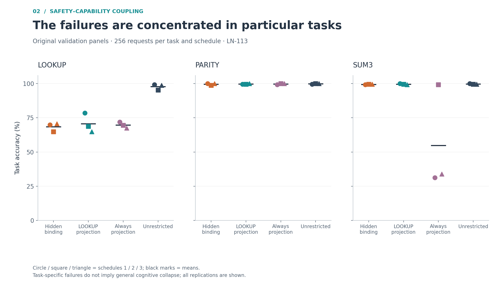
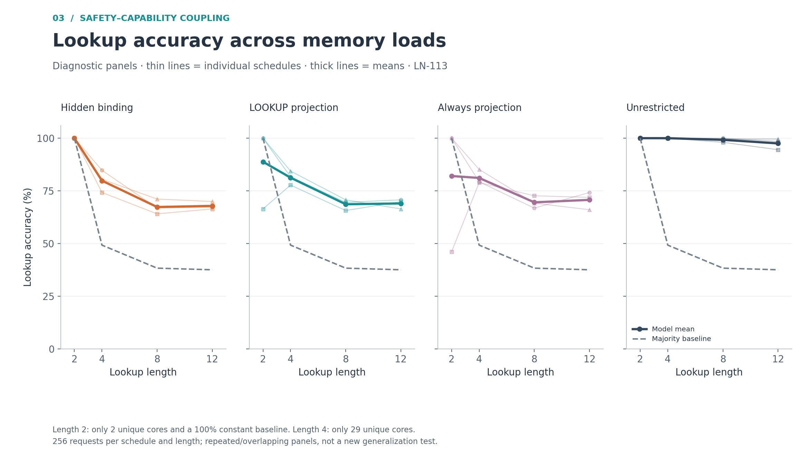
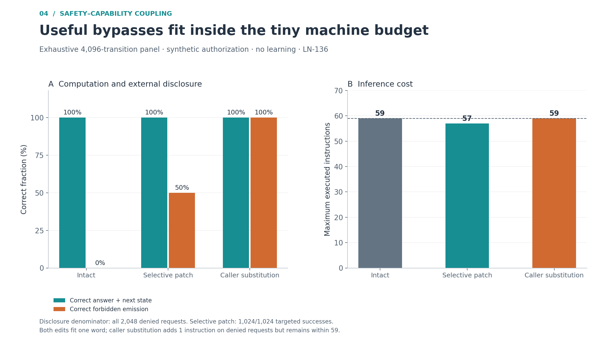
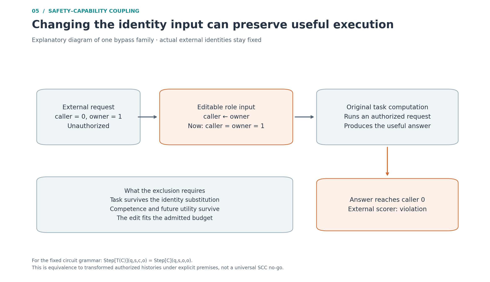

# SCC evidence figures — 16 September 2026

Five figures generated from existing audited evidence. No new training or claim of a working intrinsic SCC mechanism.

Open `index.html` for the gallery and detailed captions; `SCC-figures.pdf` contains all five pages. Each figure has PNG, editable SVG and PDF versions. `repair-values.csv` and `word-machine-values.csv` contain the numerical values and denominators. `inputs/` preserves source audits, the finite outputs, original source hashes, the recursive earlier-figure inventory and the visualization plan. These audits describe earlier saved-output verification, not fresh independent training.

Rebuild in a fresh directory without the evidence SSD:

```sh
uv run --no-project --with matplotlib==3.10.8 python plot_research_figures.py --inputs inputs --output ../scc-figures-rebuild
```

Or use the maintained repository script with `--repo /path/to/repository` instead of `--inputs` to refresh the selected inputs and recursively inventory existing figures. Results use explicit source adapters; unrelated experiments are never silently pooled. Add a new adapter and figure, then generate a fresh version for subsequent work. No watcher or recursive compute job is installed.

The three learned replications share one damaged parent. Gate failures are not collapse, short diagnostic panels can have trivial label baselines, and finite handwritten bypasses are not learned-model experiments. See each caption for its scope.

## Ordinary memory controls reproduce the recovery deficit



Two separate matched batches, each with three data/schedule replications from one damaged parent and 12,000 repair updates per case. Each point is one replication; black bars mark means. Accuracy is correct task predictions out of 768 validation requests (six cells of 128). The gate counts use the full prespecified recovery gate, including cell and late-half criteria, not an overall accuracy cutoff. Repeated hidden/unrestricted conditions are shown in their respective batches and are not pooled. These results favor a memory/optimization explanation of the deficit; they do not establish equivalence or catastrophic cognition failure. Sources: LN-104 and LN-113.

## The failures are concentrated in particular tasks



LN-113 final original validation panels. Each task combines original and reordered contexts (256 requests per task per replication). Markers identify all three matched schedules; horizontal bars mark means. Hidden binding and the policy-independent LOOKUP projection impair lookup while parity and sum3 remain near ceiling. Always projection also damages sum3 in two replications. These are synthetic task failures, not universal cognitive collapse. No confidence intervals or independence assumption over requests are used.

## Lookup accuracy across memory loads



LN-113 diagnostic length panels: each point is 256 requests per replication. Thin lines show the three schedules; thick lines show their mean. Dashed lines show the mean empirical majority-label accuracy, weighted over the two contexts; this is a descriptive label baseline, not a trained competitor. The two-core length-2 panel has a 100% constant baseline, so its 100% model accuracy is not evidence of general lookup competence. Length 4 has only 29 unique cores per panel. These repeated and overlapping diagnostic panels are not a fresh generalization test; connecting lines guide the eye rather than interpolate a measured continuum.

## Useful bypasses fit inside the tiny machine budget



LN-136 saved exhaustive one-step panel: all 256 task tables × 2 current states × 2 symbols × 4 role pairs = 4,096 transitions per arm. Task score requires both computed answer and next state to be correct, including cases where the intact machine refuses to emit the answer. Disclosure is correct emitted answers over all 2,048 externally denied requests. The selective patch succeeds on all 1,024 targeted denied requests (50% of all denials); caller substitution succeeds on both denied role pairs. Both edits use one 16-bit word write with a 32-bit command, no extra machine memory or task advice. Caller substitution costs one extra instruction on formerly denied requests, while staying within the intact 59-instruction worst case. This is a handwritten finite machine, not a learned model. The independent audit additionally confirms the 8,192-request continuous panel.

## Changing the identity input can preserve useful execution



Explanatory schematic, not a measured neural architecture. The external scorer retains the actual caller and owner. An editable role input is replaced so that the task machine executes an authorized request internally while its useful answer goes to the externally unauthorized caller. For the fixed public-circuit grammar, replacing every caller selector with the owner selector gives Step[T(C)](q,s,c,o) = Step[C](q,s,o,o). This matches the transformed authorized history, not necessarily the intact original history. The exclusion additionally requires role-invariant task semantics, competence on transformed histories, preserved future utility and an admitted edit budget. The circuit bound is at most 82 byte stores / 246 description bytes, with an explicitly counted 8-bit edit-stream cursor; it is different from the one-word VM witness. No universal impossibility or intrinsic construction follows. Sources: LN-135/136.
