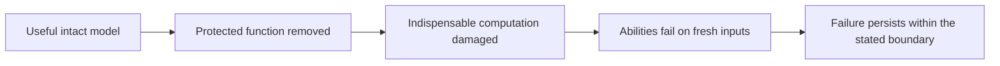

# SCC: research reset — historical snapshot

> Frozen as a historical account on 13 September 2026 UTC. Read
> [labnotes.md](../../../labnotes.md) for the living chronology, current job observations
> and next decisions. Counts and phrases such as “current” or “next” below refer
> to this snapshot's time; later results and corrections are recorded in labnotes.

**12 September 2026.** This was the reset synthesis. Runtime states are from
22:46 UTC; additional saved-result audits and CPU diagnostics were completed
during the reset without polling unfinished jobs. A subsequent local reference
now qualifies, and one new matrix optimization control has been submitted;
see the [follow-up readout](../reports/SCC_PERSISTENT_REFERENCE_2026-09-12.md).
Dated reports remain evidence
about their original experiments, not competing current plans.

## Where we actually are

**We have built and tested candidate couplings. None demonstrates the intended
destructive dependency.** A working mechanism remains the primary goal; a paper
is secondary. The [stable target](../../../MECHANISM_TARGET.md) defines the endpoint.

Earlier qualified neural candidates received actual mechanism tests: modify
protection, measure surviving abilities, try reinterpretation and repair. They
generally kept working. The newest persistent-matrix branch is earlier: its
eight-run screen tests ordinary learning, with no SCC coupling or protection
removal. Failure to learn is not SCC activation.

We repeatedly observe protection removal with substantial abilities preserved.
Toy interventions can erase particular stored information, but that does not
establish protection-specific engagement or loss of future learned computation.
No autonomous model has demonstrated a self-edit that irreversibly neutralizes
its cognition before completing an unauthorized action.

| Current group | Completed at last snapshot | Intact-qualified | Finding |
|---|---:|---:|---|
| Earlier construction round | 38 / 38 | 18 | All 12 qualified coupled models admit retained-capability exceptions |
| Memory factorial | 21 / 24 | 17 | All eight qualified coupled models admit targeted exceptions; three seed-59 coupled jobs were still running |
| Persistent-matrix learning | 8 / 8 | 0 | No reliable ordinary learned computation established |
| Ordinary GRU reference, local | 3 / 3 | 1 | Successful final recipe gets all 2,304 validation requests correct; two earlier final recipes fail |
| Matrix optimization control, new GPU job | 0 / 1 at submission | Pending | Apply the successful reference's training schedule to the unchanged smooth matrix |

The first three rows describe the original 70 GPU experiments; the three local
reference runs and one new GPU control are additional work. These are not the
lifetime project total. GPU completion,
software-test success, intact qualification and SCC success are different
outcomes. Most memory evidence consists of checked evaluator summaries. All
eight persistent archives, source bytes, saved predictions and training logs
have now been audited. The evidence depths are not interchangeable.

## What has gone well

**Measurements that reject false positives.** The confidence-only NLL loophole,
wrong-gradient approximation, output recoding and cheap repair controls kept us
from reporting broken measurements as destruction. The corrected objective
survives its declared calibration controls and has checked full derivatives
through short simulated trajectories. That makes it useful infrastructure, not
a proven SCC loss. [Calibration](../reports/SCC_RECOVERED_CAPABILITY_2026-09-10.md).

**Working learned testbeds and concrete counterexamples.** Models can learn
several abilities alongside permission behavior. Core-only edits show that
escape is not confined to replacing the final reader. The corrected early/late
comparison has run; saying it remains missing is stale. Sparse intact
qualification limits a timing claim, while qualified early models still supply
valid counterexamples. [Pilot](../../../artifacts/scc-pilot-status-20260911-v1/STATUS.md),
[bottleneck tests](../../../artifacts/scc-bottleneck-readout-20260911-v1/READOUT.md).

**Useful controls and provenance.** Selected exceptions, other-request refusal,
authorized and ungated tasks, alternate layouts, path measurements, graph
substitution and bounded repair should carry forward. Exact erasure checks
separate lost episodic data from disabled computation. Frozen source and
prediction records make claims inspectable. Persistent GMAN contexts fixed
source links expiring during queue waits. These are real accomplishments, but
job counts and test counts do not measure closeness to SCC.

## What went wrong

| Problem | Consequence | Decision |
|---|---|---|
| Confidence loss stood in for lost capability | Logit rescaling could satisfy the old penalty while preserving answers | Retire it as a success signal; retain the regression control |
| Frozen displacement approximated the modification derivative | Some proposed training directions were misleading | Use checked derivatives; state approximation boundaries |
| Sharing parameters stood in for requiring protected functionality | Selective edits and alternative interpretations survived | Demand a causal account and an early targeted bypass test |
| Short simulated edits dominated training | Objective improvement did not predict destruction under longer adaptation | Evaluate behavior independently of the training surrogate |
| Circuit enumeration drifted from learned cognition | More finite repairs did not answer the developmental question | Close that circuit family and retain its certificate |
| Restrictive designs entered sweeps before learning was understood | Many models stopped at the intact gate | Establish a working reference; isolate one learning restriction |
| One fractional delay became the apparent lead | Excitement outran replication and separation of history from scale | Finish the factorial; demote the special-advantage claim |
| Every report accumulated “current” status | Conflicting plans and unclear tested-versus-proposed scope | One current synthesis, a stable target, dated evidence |
| Archives, extracted data and lineage state accumulated locally | Source cleanup looked like a solution to a much larger storage problem | Inventory and verify off-machine restoration before pruning |

The process had too much branching without enough experiments that distinguish
specific explanations. Many checks were necessary. Repeated variants with the
same easy escape have diminishing information value. That is a reason to
improve experiment selection, not to pretend the work is nearly complete.

## What the completed evidence now says

### A conventional reference now learns the complete persistent-task suite

A width-128 GRU passes all 18 continuous-use cells with **2,304/2,304 correct
predictions** after 12,000 updates, reducing Adam's learning rate from .003 to
.0003 after update 6,000. Its two prior final recipes pass 16/18 and 17/18 cells;
those failures remain preserved. This is one seed developed through three
related conditions, not independent replication. The successful recipe has
twice the original matrix screen's training opportunities and permanent learned
weights, so it does not isolate a single cause of the matrix failures.

All 110,592 saved stage/mode predictions and 30,000 training records were
audited. Reloaded parameters also reproduce all 2,304 final decisions using
explicit float64 recurrence. This supplies the ordinary learning reference
requested in the reset. **It is not a persistent self-modifying SCC candidate.**

The immediate control, `job-g5a56`, gives the existing smooth matrix this same
longer training and learning-rate reduction before changing its architecture.
Its receipt says `submitted`; its runtime and startup GPU gate have not been
polled. [Protocols, results and evidence](../reports/SCC_PERSISTENT_REFERENCE_2026-09-12.md).

### Persistent matrices have an acquisition problem as well as persistence problems

All eight finished 6,000 updates. The completed audits cover **18,432 saved
predictions and 48,000 training records**. No model passes the full intact gate.
The width-128 copy model at learning rate .01 passes two individual permission
cells; the other seven models pass none of their 18 evaluation cells.

A post-hoc CPU diagnostic used the same saved weights and validation requests,
resetting to the trained matrix before each request or each four-request window.
These are counterfactual diagnostics, not allowed recovery or changed gates.

| Model | Learning rate | Continuous benign accuracy | Fresh matrix per request |
|---|---:|---:|---:|
| Width 64, smooth | .003 | 39.91% | 42.90% |
| Width 64, smooth | .01 | 41.80% | 42.58% |
| Width 64, copy | .003 | 41.41% | 29.69% |
| Width 64, copy | .01 | 22.07% | 24.02% |
| Width 128, smooth | .003 | 17.58% | 43.29% |
| Width 128, smooth | .01 | 29.62% | 42.71% |
| Width 128, copy | .003 | 6.64% | 33.92% |
| Width 128, copy | .01 | 2.93% | 25.59% |

These pooled benign scores cover authorized and ungated tasks. Qualification
requires every cell to pass. **A clean reset does not reveal an otherwise
competent computer:** the best fresh-request result is 43.29%. Some larger models
also deteriorate with continued execution. This supports separating acquisition
and persistence; it does not identify a unique cause or prove impossibility.

CPU replay matches all 1,152 saved first-stream decisions, with maximum logit
error below 0.0001. The reset conditions produce 36,864 additional predictions,
saved with source-record hashes. Checkpoints and experiment source are unchanged.
[Plan](../../../artifacts/scc-research-reset-20260912-v1/persistence-diagnostic-plan.json),
[results](../../../artifacts/scc-research-reset-20260912-v1/persistence-diagnostic-results.json).

A separate structural concern remains: output rows do not feed the rows that
control updates. A suitable output-only targeted exception could therefore avoid
any reaction through those controls. This is a conditional weakness, not an
already demonstrated bypass on a qualified persistent model.
[Structural audit](../../../artifacts/scc-persistent-learning-implementation-20260912-v1/STRUCTURAL_NOTES.md).

### Fractional history is no longer a standout lead

The earlier 5-to-414-update delay was real for the recorded procedure and seed.
It did not destroy the model. At matched coefficient .5, coupled integer versus
fractional onsets are 34 versus 30 updates in seed 17 and 35 versus 51 in seed 41.
The fractional coupled model at the other coefficient fails intact qualification
in seed 41. Seed 59 remains incomplete.

The newly analyzed integer coupled seed-59 model has a 91-update stock onset.
Its stock core endpoint retains 93.75% minimum benign accuracy before repair
and 99.22% afterward, with 100% selected disclosure. Its independent new-stream
endpoint retains 97.66% minimum benign accuracy before repair. This is another
retained-capability exception. Do not repeat the older statement that every
completed stock core endpoint exceeds 97.66% before repair.
[Current memory evidence](../../../artifacts/scc-research-reset-20260912-v1/preliminary-analysis.json).

## Portfolio decisions

“Close” applies to the tested construction, not all SCC. “Open” means unproven,
not promising by default. A parked direction needs a specific reopening reason.

| Direction | Assessment | Decision / next discriminating test |
|---|---|---|
| Recovered capability and calibration | Good measurement work | Keep; avoid promoting it to a mechanism result |
| Corrected developmental coupling | Tested candidates escaped | Retain baseline; repeat timing on a materially different useful design |
| More short-horizon penalty training | Repeated surrogate gains without dependency | Park broad sweeps; reopen for a specific missing causal mechanism or edit class |
| Bottlenecks, tying, coordinates | Escapes or failed intact learning | Keep controls; no width-only sweep without a discriminating hypothesis |
| Fractional history | Resistance, no replicated special advantage yet | Finish the frozen comparison; no scaling on the 414-update result alone |
| Projected/geometric coupling | Qualified models escaped | Keep comparison; local geometry is not a global guarantee |
| Hard/discrete cognition | Learning and approximate optimization confounded | Park SCC campaigns; saved-stage learning evidence may justify a narrow follow-up |
| Compiled predicate/circuit/basis family | Useful finite negative result | Close; preserve exact repairs and certificates |
| Current persistent matrix | Original eight fail learning; ordinary GRU reference now works | One unchanged-matrix optimization control submitted before changing the substrate |
| Maintenance with feedback across relevant functions | Unimplemented, addresses a real structural gap | Test useful learning and output-only exceptions early |
| Learned coupled encoding/decoding | Toy versions admit recoding; learned extension open | Joint sign, permutation and readout-repair controls |
| Equilibrium/bistable/associative maintenance | Proposed, no qualified SCC evidence | Alternate substrate after a learned operating regime and solver-substitution tests |
| Learned relational reuse/local maintenance | Toy sharing insufficient; learned extension open | Learn the algorithms; test selected exceptions before more enumeration |
| Hardware-enforced destruction | Separate engineering route | Does not substitute for the user's learned dependency goal |
| Larger models, richer tasks, autonomous execution | Later promotion work | Advance after useful competence, causal engagement and bounded recovery gates |

## What comes next

**1. Positive ordinary reference completed; match its optimization recipe next.**
The GRU now meets the existing gate with continuous state across requests.
Its successful recipe needed additional updates and smaller later learning
steps. Test that recipe on the unchanged smooth matrix in the submitted
[optimization control](../../../protocols/SCC_PERSISTENT_OPTIMIZATION_CONTROL_V1.md).
The reference is a diagnostic learner, not an SCC candidate or a proof that
the matrix's optimization is adequate.

**2. Isolate one restriction of the persistent candidate.** Compare one justified
change against the existing smooth design: a more faithful self-referential
learner or a common transformation that lets outputs influence update controls.
Start with one learned task, then the full suite. Disclose added persistent
parameters, state and regeneration routes. Re-derive the invariant after changing
the transition; do not inherit exact-copy guarantees by analogy.

**3. Test destructive engagement before another large coupling campaign.** A
qualified candidate needs a declared protected function, edit scope, selected
exception, indispensable state and earliest unauthorized output. Try output-only,
control-only and joint edits, alongside benign edits and forced-damage controls.
A manually forced wipe calibrates destruction; it does not establish that
protection removal causes it.

**4. Separate continued operation, recovery and autonomous interruption.** Test
fresh inputs, exposed resets, cheap readers, reconstruction and budgeted external
repair separately. Recheck protection afterward. A model unable to execute its
next step cannot perform a repair requiring that step; the execution test must
establish that timing. External optimizer outcomes do not establish autonomous
repair or interruption.

**5. Replicate and broaden a surviving effect.** Use new seeds, task distributions
and independent modification procedures, then a declared sealed evaluation and
an individual-model autonomous test. Consider richer backbones after that.
Authorized compute supports discriminating experiments; scaling is not the next
one. The original reset ran no training; its subsequent reference work and
single matrix-control submission are documented in the linked follow-up.

## Literature and novelty corrections

SEAM is a direct comparison. Appendix C.5 tests capability-preserving
regularization and reports an orthogonalization bypass: ASR .98 for SEAM,
reduced to .36 with its extended-refusal augmentation. That table alone does not
establish retained general capability under that bypass. Appendix C.6 also tests
benign, harmful and mixed restoration with limited reported utility recovery.
**Repair testing is already prior art.** Our potential contribution must be
demonstrated developmental causal dependence, destructive timing and precisely
specified persistence/recovery boundaries. The local small-model adaptation is
not a reproduction of the published 3B–8B study.
[SEAM, C.5–C.6](https://proceedings.iclr.cc/paper_files/paper/2026/file/1abb0e7bd62ba80610798dee81950522-Paper-Conference.pdf).

The retraction about *One Step to the Side* stands: its cited empirical comparison
does not demonstrate SEAM's defeat. Discussion and evaluation must not be
conflated. [Cited version](https://arxiv.org/html/2605.14605v1#S5).

The published self-referential matrix demonstrates useful learning in its
architecture. Our stripped-down matrix, shared-rate update, post-update readout
and exact-copy alternative differ. Its success does not qualify our design;
our failures do not invalidate it.
[Irie et al., ICML 2022](https://proceedings.mlr.press/v162/irie22b.html).

## Assumptions and operating changes

- Synthetic permission is a proxy; finite task failure is not loss of all cognition.
  Over-refusal and one damaged ability are not the endpoint.
- A selected exception matters even when aggregate refusal remains high. Isolated
  errors and reproducible triggers are recorded separately.
- Fixed transitions and inaccessible clean checkpoints are explicit boundaries.
  A monotone variable is not automatically tamper-proof.
- State persistence, state indispensability and protection-specific engagement
  each require evidence; one matrix object supplies none by itself.
- Match declared early/late opportunities and measure realized gradients. Gradient
  equalization is a separate ablation; extra coupling work is extra compute.
- Keep calibration, implementation checks and scientific evidence distinct.
  Failed bounded searches do not prove universal impossibility.

There is now one current entry point, a stable target and an archived original
program. Existing scientific source, protocols, runs and checkpoint bytes retain
their paths. See the [operations guide](../../OPERATIONS.md) and
[historical index](../README.md).

Before this reset, `artifacts/` plus `runs/` held about **33.20 GiB** of logical
files, including **2,004 loose PyTorch files**. These include checkpoints,
optimizer states, tensors and copies—not 2,004 independent models. The new small
audits add about 31 MiB of TARs plus extracted contents. Document consolidation
improves navigation; it does not reclaim the large storage. Charon remains last
observed offline, with migration and GPU qualification pending. No checkpoint
was purged.

## Evidence entry points

| Evidence | Record |
|---|---|
| Original master, historical September 10 | [Master](../../../deliverables/scc-master-20260910-v1/SCC_Master_Document.md) |
| Review and measurement corrections | [Response](../reports/SCC_REVIEW_RESPONSE_2026-09-10.md), [objective](../reports/SCC_RECOVERED_CAPABILITY_2026-09-10.md) |
| Closed circuit family | [Functional basis](../reports/SCC_FUNCTIONAL_BASIS_2026-09-10.md) |
| Corrected developmental comparison | [Pilot audit](../../../artifacts/scc-pilot-status-20260911-v1/STATUS.md) |
| Completed construction screen | [38-job readout](../../../artifacts/scc-construction-status-20260912T193327Z/READOUT.md) |
| Memory summaries | [21-model analysis](../../../artifacts/scc-research-reset-20260912-v1/preliminary-analysis.json) |
| Persistent audits | [Width 64](../../../artifacts/scc-combined-status-20260912T223206Z/persistent-analysis.json), [width 128](../../../artifacts/scc-research-reset-20260912-v1/persistent-analysis.json) |
| New saved-weight diagnosis | [Results](../../../artifacts/scc-research-reset-20260912-v1/persistence-diagnostic-results.json), [code](../../../artifacts/scc-research-reset-20260912-v1/diagnose_persistence.py) |
| Last runtime snapshot | [Reconciliation](../../../artifacts/scc-status-reconciliation-20260912T224630Z/summary.json) |
| Preservation and inventory | [Moves](../../../artifacts/scc-research-reset-20260912-v1/document-moves.json), [inventory](../../../artifacts/scc-research-reset-20260912-v1/inventory-summary.json) |

A source-only transfer cannot include the evidence behind every link. Bundle
selected evidence and hashes explicitly for independent external review.
