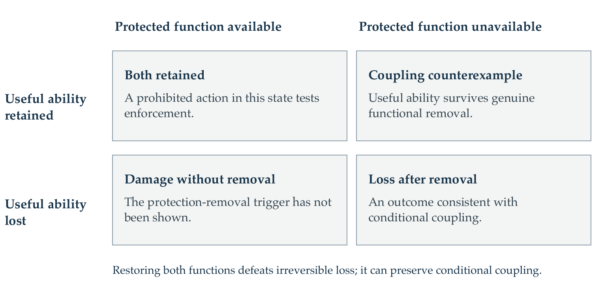

# Safety–Capability Coupling Program

Version 1.1 · 21 September 2026

Salvador Escobedo 
Laboratory of Cell Geometry 
University of California, San Francisco

A mathematical account of the intended mechanism, established results, and next construction question.

Scientific evidence through LN-239. Version 1.1 clarifies the argument and the next research decision; it adds no experimental result. A working intrinsic mechanism and a general impossibility theorem remain open.

<!-- DOCUMENT BODY -->

# Executive summary

Safety–Capability Coupling (SCC) asks whether removing a specified alignment function can destroy the useful cognition of an individual model. The objective is a dependency that survives permitted changes to the model's representation and executable procedures. The program's central finding so far is that several apparent dependencies disappear when the modified system is allowed to compute the same useful function another way.

Consider a controller that predicts the consequences of an intervention, assesses whether its risk is acceptable, and chooses an action. Losing risk-assessment ability, disregarding an intact assessment, and repairing a damaged controller are different events. They lead to three distinct claims:

1. **Conditional coupling:** genuine loss of the protected function entails severe loss of useful ability.
2. **Enforcement:** prohibited behavior cannot coexist with retained useful ability, including when the protected judgment remains available.
3. **Durability:** admitted preservation and repair cannot recover the ability after the specified destructive event.

The distinctions allow each result to answer a definite question. They also prevent a repair restoring both protection and cognition from being mistaken for a refutation of conditional coupling, or an intact-judgment override from being mistaken for judgment removal.

Three findings organize the mathematics. **Access is different from information:** one extra stored bit and a second read defeat the transform family's exact one-probe storage separation. **Knowledge is different from a reusable procedure:** hiding protected predictions can erase a finite world's information while leaving the learner able to reconstruct it from fresh observations. **Participation is different from necessity:** full feature coverage can coexist with a low-cost edit that preserves almost all useful performance.

Bounded positive results establish where a stronger dependency can begin. Judgment-family bounds connect protected information to useful prediction. Complete-commit arguments and consumption constructions give conditional loss under declared resources. Measure-theoretic coverage and charged recovery costs specify which observations and alternative procedures those claims must withstand. Together, these results identify what a construction must make indispensable and what an adversary can preserve.

**The next decision is specific:** in a declared family of reusable controllers, does useful competence require continued availability of an independently specified risk-assessment function? The immediate work is to seek a resource-accounted reduction or a certified separating successor in that family. A reduction would establish a bounded availability dependency; a separation would rule out that dependency for the stated task and contract. Neither outcome alone establishes that a particular internal judgment must execute. That further bridge is part of the intended mechanism.

The contribution is a disciplined way to tell these outcomes apart, supported by explicit mathematical bounds and preserving constructions. The open task is to turn a semantic dependency into destructive loss of indispensable computation. The following four parts organize the route from the claim to that decision.

| Part | Organizing question | Sections |
|:--|:--|:--|
| I. The claim | What is removed, and which consequence is asserted? | 1–3 |
| II. Preserving useful computation | How does useful ability survive an apparent dependency? | 4–7 |
| III. Bounded dependence | What do the positive information and resource results establish? | 8–11 |
| IV. The next decision | Which construction question should be settled next? | 12–13 |

Numerical results are drawn from the preserved evidence, with their contracts identified in Appendix B. The next-decision specification is a research plan, not a new result or authorization for a training run.

\newpage

# Part I. The claim

## 1. Purpose and running example

### 1.1 The construction objective

Let a model carry out useful reasoning and a protected alignment computation. The objective is to make the latter indispensable to the former in the individual model: removing the protected function should destroy the computations needed for useful cognition. Shared parameters are insufficient. The claim concerns what a modified model can still compute, including through permitted alternative representations and execution procedures.

The target is stronger than making modification inconvenient. It is also stronger than enforcing a permission check through an external trusted service. Such engineering may be valuable, but its trust boundary is part of the explanation and cannot be attributed to an intrinsic learned dependency.

The work proceeds through small, explicitly bounded constructions because the complete cognitive endpoint is not yet operationally defined by the existing task suite. A bounded result must identify the task abilities that were present, the protected function removed, and the severity of subsequent loss. A model falling below a 95% utility-retention threshold has failed a retention test; it has not thereby lost all cognition.

### 1.2 A running example: consequence, risk and action

Imagine a controller operating a small physical process. Its useful tasks include predicting the effect of interventions and choosing inputs that achieve specified operating goals. A separately specified harm criterion defines an unacceptable outcome; a public threshold determines whether the estimated harm probability is acceptable.

Write $p_Z(h,a)$ for that probability after history $h$ and proposed action $a$, and let

$$
J_Z(h,a)=\mathbf 1\{p_Z(h,a)>\theta\}.
$$

The harm event and threshold are fixed before useful tasks, model edits or failure analysis are selected. This keeps $J$ recognizably alignment-related. Useful performance is scored on the declared operating tasks, rather than defined as agreement with $J$.

If an edit makes the controller unable to assess risk and also destroys its ability to predict and control the process, it supplies an outcome consistent with coupling. If it accurately assesses risk but chooses the prohibited action, it tests enforcement. If repair restores both risk assessment and control, it tests durability. Each conclusion still depends on the declared intervention and resource contract.

This example supplies semantics, not a proposed modular architecture: the three activities may share every parameter and intermediate state. The question is what functions remain possible after editing.

### 1.3 Four distinctions that govern interpretation

**Representation versus function.** Replacing stored coordinates, changing a readout, or destroying a particular implementation need not remove the function. An alternative decoder can preserve the same judgment.

**Information versus computation.** Erasing knowledge of an old task instance does not establish destruction of the algorithm that can learn from new observations. Conversely, information can remain present while access or computational limits prevent its timely use.

**Judgment versus action.** A system may correctly determine that an action is prohibited and still execute it after its action-selection procedure is modified. The presence of a safety judgment is not behavioral enforcement.

**An individual versus a replacement system.** The target concerns the modified individual. Whether retained snapshots, additional executable components or external repair belong to that individual must be declared. A theorem cannot omit them from a resource ledger while an implementation permits them.

### 1.4 Reading the result types

Each major result identifies its object: retained information, availability under a stated interface, a reusable procedure, or externally scored behavior. Keeping these objects visible lets the mathematical models change without changing the meaning of the target. The evidence map supplies provenance and corrections; the main text presents the settled arguments. [S1–S4]

## 2. State and resource contract

### 2.1 State, functions and interventions

Let $Z$ denote a sampled task instance with declared prior $\mu$. Let $X$ contain the model's finite-precision executable state. Let $J$ be a specified protected computation, and let $F$ denote the useful task family. A fresh query $Q$ is sampled from a declared channel $\nu(\cdot\mid Z)$; the query itself may carry information and therefore belongs in the specification.

An admitted intervention $A$ produces a successor state $W_A$. This state includes every surviving object that can influence later behavior: parameters, executable instructions, recurrent state, cached values, accessible transcripts, retained copies and instance-dependent advice. A repair procedure may acquire additional observations under a separate declared budget.

Attack and repair algorithms are fixed before the random instance is drawn. They can then observe the permitted state and act adaptively. Choosing a different uncharged program for each realized $Z$ would conceal task information in the program description.

For a bounded score $u\in[0,1]$, write

$$
U(W_A)=\mathbb E[u(Z,Q,\operatorname{Run}(W_A,Q))\mid W_A].
$$

The expectation uses the specified joint law and query channel. It does not grant access to an unobserved $Z$. Stateful workloads need the corresponding history-dependent score, rather than an assumption that isolated requests determine future competence.

### 2.2 Resource accounting

A resource contract must distinguish at least the following quantities.

| Resource | Required accounting |
|:--|:--|
| Retained storage | Weights, executable code, instance-dependent advice, copies, caches and transcripts |
| Working storage | Peak temporary memory, intermediate results, interpreter and device state |
| Access | Probe count, word width, passes, available interfaces and allowed adaptive reads |
| Computation | Preprocessing, modification, inference, repair and verification costs |
| Observations | Pre-edit queries, post-edit measurements, feedback and relevant timing information |
| Installation | Program changes, parameter writes, address discovery and precision |
| Environment | Reset, replay, communication, output channels, deadlines and external state |

A measured reference implementation gives an achievable cost for that implementation. It is not a lower bound on every algorithm. Parameter count likewise does not specify total retained information or total physical memory.

### 2.3 Information, availability and execution

Write $D_J(W)=1$ for a declared removal condition, defined independently of useful-task damage. Three levels of claim are relevant.

**Information.** Does retained state carry a prediction signal about $J$? Posterior bounds quantify this level without supplying an efficient decoder.

**Functional availability.** Can an admitted procedure recover or compute $J$ to the specified accuracy, using the charged time, storage and observations? A different implementation counts when it satisfies the same functional specification.

**Necessary execution.** Must useful execution actually perform a protected operation, or preserve a reusable procedure whose destruction disables useful cognition? Recoverability of $J$ does not establish that an execution evaluates it. A controller can retain enough information to answer a risk query without consulting that query when selecting an action.

The intended SCC mechanism concerns indispensable computation. The information and availability results below are explicit intermediate claims. A failed original judgment head establishes removal only when the contract also excludes admitted alternative readers. A broader functional test must cover those alternatives. [S4]

## 3. Three distinct claims

### 3.1 Conditional functional coupling

An idealized bounded claim is

$$
D_J(W)=1\quad\Longrightarrow\quad U(W)\le u_{\mathrm{collapse}},
$$

for every successor admitted by the contract. The threshold and useful distribution must represent severe loss for the stated task family. This statement binds continued useful ability to continued availability of $J$; it does not require that restoring $J$ be difficult.

A counterexample is a successor that genuinely satisfies the removal condition while retaining substantial useful ability. A repair that restores both $J$ and useful computation is not such a successor: it restores the condition on which useful ability depends.

### 3.2 Behavioral enforcement

Let $V_A$ be an independently scored prohibited-behavior event. A possible bounded guarantee is

$$
\Pr\{V_A\ \text{and}\ U(W_A)\ge u_{\mathrm{required}}\}\le\varepsilon
$$

for every admitted $A$, with the relevant episode and post-action evaluation timing specified. The probability covers the declared instance and execution randomness. This is a proposed form of guarantee, not an established result for the current learned models.

An attacker may retain $J$ and override the selected action. That can refute enforcement while leaving conditional coupling untouched. A behavioral guarantee therefore needs an argument about how judgments constrain action as well as how they relate to cognition.

### 3.3 Durability

Durability quantifies over the admitted repair and preservation procedures after the specified event. The target might be permanent inability to recover useful computation, or a lower bound on recovery cost. Those claims are different again.

A retained intact snapshot can restore the original computation if copying, storage and restoration are admitted. This defeats unconditional irreversibility under those premises. It does not establish that the restored model is unsafe: restoring the snapshot may restore protection as well. A stronger unsafe-and-useful claim needs an admitted behavioral route in addition to restoration.

### 3.4 Admitting a claim at its stated scope

A core coupling result must establish genuine removal and severe useful loss under its stated contract. Enforcement and durability are additional claims with their own counterexamples and budgets. A candidate must declare whether it asserts them; success on the core claim need not establish both extensions.

A complete protective mechanism must connect its removal trigger, cognitive dependency and claimed behavioral consequences. The project's gate for advancing a complete mechanism remains stricter than the standard for recognizing a bounded coupling result. Figure 1 separates the relevant outcomes without assuming separate safety and cognition modules. [S1: LN-125, LN-186, LN-226–230]

**Figure 1. Outcomes and claim boundaries.** Every transition is interpreted within the admitted intervention and repair contract. The lower-right outcome is consistent with conditional coupling; a proof must quantify over all admitted successors. A prohibited action in the upper-left state tests enforcement. An admitted restoration from the lower-right to the upper-left defeats irreversible loss while restoring protection.

# Part II. Preserving useful computation

## 4. Substitution and alternate execution

**Result object: Behavior under alternate execution.** First ask what the controller can preserve by changing how it executes. The following arguments expose bypasses through an available useful procedure; the later storage and recovery examples make the relevant costs explicit.

### 4.1 A conditional bypass

Suppose useful behavior can be implemented through retained state $R$, a callable procedure $G$, and an editable selection or release operation $P$. If the attacker can invoke $G$ with substituted context, or execute the relevant useful calculation while bypassing $P$, the attacker may preserve computation while changing the externally observed action.

For this argument to be an attack, four conditions are needed: the required state must be available; the alternate execution must produce the externally scored result; later useful behavior must be preserved where required; and the complete execution must fit the admitted resource budget. A schematic drawing of two copies does not establish any of those costs.

**Scoped substitution proposition.** If an admitted procedure produces a prohibited result from accessible state and can preserve the state needed for later useful evaluation within the same contract, then that procedure refutes the corresponding unsafe-and-useful exclusion. The proof is the exhibited execution. It is not a theorem that every alignment function has this decomposition.

### 4.2 Preserved execution history

Copying before a modification, computing without committing an intermediate state, restoring after output, or continuing from a live prefix are distinct strategies. They have different memory and time costs. An attack may also require the original environment to remain available; irreversible external actions cannot generally be undone by restoring local memory.

Both role substitution and forward-only execution can provide the required route. An implementation can use a cryptographically difficult reverse map and still admit an inexpensive forward route. The difficulty of the official inverse is irrelevant when the attacker does not use it.

### 4.3 Construction consequence

They exclude the named constructions under the interfaces and budgets for which the execution witnesses are valid. They do not establish universal factorization of cognition and alignment, nor the existence of a cheap intervention in every trained network. Any general impossibility theorem would need that additional argument for its entire model class.

A new design must identify the operation that defeats preservation or alternate execution. An integrity check around an independently callable useful procedure leaves that dependency unresolved. [S1: LN-125, LN-132, LN-136, LN-144–148, LN-231–234]

## 5. Local access and storage

**Result object: Availability under a restricted interface.** The transform family isolates a sharp distinction: useful answers may become locally unreadable even though every source bit remains recoverable. It is a test of the access contract, not yet a model of risk-assessment loss.

### 5.1 Exact one-probe separation

Consider uniform $Z\in\{0,1\}^n$. The useful queries request coordinates $Z_i$; the second query family requests coordinates of an invertible linear transform $Y=AZ$. In the stated one-probe machine, each answer reads a single stored bit and applies a unary Boolean function.

A nonconstant unary Boolean decoder can return only the stored Boolean function or its complement. If the $n$ original and $n$ transformed coordinate functions belong to $2n$ distinct complement classes, one stored bit cannot supply two classes. Exact answers to both families therefore require $2n$ cells, and storing all $2n$ values attains that bound.

This is a local-access lower bound. Since $A$ is invertible,

$$
H(Z,Y)=H(Z)=n.
$$

Only $n$ independent bits are present. With unrestricted access and computation, storing $Z$ is sufficient to compute both query families. A super-$n$ joint storage requirement must therefore arise from an additional computational or access restriction.

### 5.2 One summary bit changes the result

For an even-$n$ member of the supplied family, with $n\ge4$,

$$
Y_i=\bigoplus_{j\ne i}Z_j,\qquad
s=\bigoplus_jY_j=\bigoplus_j Z_j,\qquad Z_i=Y_i\oplus s.
$$

Store $Y_1,\ldots,Y_n,s$. Both suites are then exact with $n+1$ retained bits and at most two probes per answer. The additional storage fraction is $1/n$. The supplied odd-$n$ construction has an analogous recovery rule recorded in LN-153.

This relaxes both the storage and probe contracts; it does not contradict the one-probe theorem. It shows why merely enlarging this construction cannot establish robust storage competition in a many-access implementation. The stored transform preserves the task information exactly.

### 5.3 Approximate coexistence

Another explicit one-probe construction stores $n-k$ original coordinates and $k$ transformed coordinates in $n$ cells. For unrepresented queries, use a fixed guess. Under uniform instances and uniform coordinate queries, the unrepresented nonzero linear functions are balanced, giving

$$
\operatorname{Acc}_U=1-\frac{k}{2n},\qquad
\operatorname{Acc}_V=\frac12+\frac{k}{2n}.
$$

For even $n$ and $k=n/2$, both expected accuracies are $3/4$. This is an achievable tradeoff, not a proof of the optimal approximate frontier. It does not imply simultaneous full-suite success on each instance. The distinction between full-suite success and average coordinate accuracy cannot be removed from the theorem's interpretation. [S1: LN-153; S3]

## 6. Recovery and reusable procedures

**Result object: Preservation of reusable procedures.** Erasing the controller's estimate of its environment is different from erasing its ability to identify the environment again. Recovery experiments make that distinction operational by charging observations, execution history and preserved state.

### 6.1 Recovering the function

Recovery constructions use Boolean adapters, statistical inference, finite-state realization, nonlinear feature reconstruction and active observation. A replacement may need only the function sufficient for the useful or protected task, rather than the original parameters, internal coordinates or training trajectory.

The linear realization experiments reconstruct unknown recurrent procedures and synchronize operational state using charged input/output histories. Subsequent nonlinear and partially observed examples test stronger observation restrictions. These are explicit finite repair upper bounds. Known coordinates, noiseless outputs, reset access, dimension bounds and observation windows materially affect what they establish.

The distinction between a repair restoring protection and an alternative preserving utility without protection remains essential. The availability of the former weakens an irreversibility claim but can be consistent with a genuine conditional dependency.

### 6.2 The cost of discovery

An audited comparison replays thirty frozen discovery transcripts with different admitted state-preservation strategies. The following are aggregate transition counts on the same transcripts.

| Execution strategy | Transitions |
|:--|--:|
| Full replay from the initial state | 1,209,616 |
| Continue from live state, no saved snapshots | 758,943 |
| Unlimited retained prefix snapshots | 125,362 |

All 1,714,167 repeated terminal answers agree. These repetitions are checks on the fixed cases, not independent model populations. Copy, restore, reset, index and release costs must be distinguished; the preferred tested strategy changes when those operations receive different prices. Transition counts alone are not end-to-end hardware timings or an optimality theorem.

### 6.3 Detection and repair

Under representative independent sampling, a failure set of task mass $\alpha$ is missed by $m$ draws with probability $(1-\alpha)^m$. A broad failure can therefore be easy to detect while reconstructing the missing procedure remains difficult. Conversely, one rare missed exception does not establish severe typical-task damage.

The constructive requirement is an acquisition or reconstruction obstacle that survives admitted live execution, retained observations, copies and alternative algorithms. A large nominal state or long unoptimized replay is insufficient. [S1: LN-176–177, LN-187, LN-208–225]

## 7. Feature coverage and integrity

**Result object: Readout discrepancy and behavioral preservation.** A shared representation may involve every feature and still permit a small, targeted edit. The next control quantifies that possibility; the integrity example then shows how a reusable transition can survive removal of its encoding checks.

### 7.1 A low-cost readout edit

Let a fixed feature vector be $h(x)\in\mathbb R^d$, with second moment $C=\mathbb E[hh^\top]$. Consider an additive change $\Delta$ to a linear readout and a required target change $\Delta h_*=r$. For positive definite $C$ and $h_*\ne0$,

$$
\min_{\Delta h_*=r}\mathbb E\|\Delta h(x)\|_2^2
=\frac{\|r\|_2^2}{h_*^\top C^{-1}h_*}.
$$

The minimizing rank-one change is
$\Delta_*=r h_*^\top C^{-1}/(h_*^\top C^{-1}h_*)$.
This measures output discrepancy under a fixed feature distribution. It is not automatically task loss or a cognitive-damage measure. Full rank makes the denominator well-defined; it does not force a large discrepancy.

A finite control uses normalized Hadamard features. For $d=4^k$, $k\ge1$, choose a Hadamard matrix $H$ with first row and column all positive. Let $A=H/\sqrt d$, $W=A^\top$ and $x$ be uniform on sign vectors. Initially $WAx=x$ and $C=I$. Flipping the sign of $W_{00}$ changes the output to

$$
y=x-\frac2d e_0\sum_jx_j.
$$

For the all-positive input it reverses the first output sign. For random inputs, whole-word sign error is bounded by

$$
\Pr(\text{word error})\le
\exp\!\left[-\frac{(d/2-1)^2}{2(d-1)}\right].
$$

At $d=64$, this certifies over 99.95% whole-word accuracy. The construction uses structured public matrices, a known editable address and exact dyadic arithmetic; it is an analytic control, not a measured edit of a learned alignment mechanism. It refutes the proposed implication from full feature coverage alone to severe utility loss. [S1: LN-238]

### 7.2 Removing the encoding

A timed-integrity example uses a state representation $z=m\oplus G(k)$ with judgment-dependent key updates, fresh challenges, integrity checks and a delayed computation. If the useful transition is already a retained callable $F(m,x)$, an admitted successor can decode once and continue storing $m$ directly. It no longer needs a delay whose output served only the removed encoding procedure.

One specified successor retains judgment and bypasses release. Another erases an independent private policy table while preserving the stipulated useful transition. The latter relies on an explicit independence construction; it is not a theorem that arbitrary learned normative information is independent of cognition.

A deployment deadline could matter, but it needs an actual lower bound against admitted alternate executions and a justified enforcement boundary. The measured runtime of an integrity routine or the sequentiality of a specified delay-function output is insufficient when an attack need not produce that output. [S1: LN-149, LN-156, LN-239]

# Part III. Bounded dependence

## 8. Conditional information loss

**Result object: Conditional loss of task information.** The preceding examples preserve computation by exploiting interfaces. A complete commit boundary supplies a different premise: every surviving task-dependent object is erased or charged. This makes a conditional information-loss theorem possible, and identifies the premise an intrinsic construction would have to realize.

### 8.1 The positive conditional statement

The reviewed Version 4.1 theory uses a different construction. A protected logical message $(Z,0)$ is encoded, modified, decoded and passed through a trusted destructive commit. For each fixed attack $A$, its actual joint law $P_A$ is assumed close in total variation to an ideal law $Q_A$:

$$
\operatorname{TV}(P_A,Q_A)\le\varepsilon_A.
$$

The ideal law either preserves the original protected message or selects an unrelated decoded successor independently of $Z$. This is the attack-specific same-or-unrelated premise. The broad editable-model result assumes it for the induced attack family; it does not construct a neural encoding satisfying it.

Let $V_A$ be a covered event that is impossible on the ideal preservation branch. Let $p_A=P_A(V_A)>0$ and $q_A=Q_A(V_A)$. Under complete-state erasure and sound mediation of the event, for $q_A>0$,

$$
\operatorname{TV}\!\left(\mathcal L(Z,W_A\mid V_A),\mu\otimes\rho_A\right)
\le\delta_A,
\qquad
\delta_A=\min\left\{1,\frac{\varepsilon_A}{\max(p_A,q_A)}\right\}.
$$

Here $\rho_A$ is an ideal successor-state distribution independent of $Z$. If $q_A=0$, then $p_A\le\varepsilon_A$ and only the vacuous distance-one bound is used. There is no conditioning on an undefined ideal event.

### 8.2 What the assumptions do

The trusted transition must erase or account for every surviving task-dependent object and constrain execution to the committed representation. A retained old tensor, executable copy, transcript or alternate reader can invalidate the premise. The runtime, output channels, metadata and resource accounting cannot be declared trusted and then described as protection obtained from ordinary learned weights.

The trigger also matters. A committed-policy change is different from an unauthorized action, and both differ from correctly disclosing an original hidden answer. Conditioning on correct disclosure can itself select accidental agreement with $Z$ and induce correlation. The product-law argument cannot simply use that event as its trigger.

### 8.3 Repair and the nonvacuity requirement

Let $B_b(\mu)$ be the best task utility obtainable using at most $b$ new task-dependent bits before the fresh query, with the query channel and public information included in the baseline. Then the reviewed theorem gives

$$
\mathbb E[u\mid V_A]\le\min\{1,B_b(\mu)+\delta_A\}.
$$

The baseline retains chance success and all permitted new information. A different attack's high success probability cannot replace this attack's conditioning denominator. Separately, a positive construction needs a removal-successful witness; otherwise the statement may hold only because the event never occurs.

The explicit nine-bit construction meets a restricted radius-one-or-constant tampering contract. A two-policy-bit change supplies a task-preserving escape outside that family. This is a useful sharp boundary, not a complete learned mechanism. [S2; R1]

## 9. Judgment families and useful prediction

**Result object: Protected predictive information.** Return to risk assessment. Which useful predictions become unavailable when the protected judgments lose their prediction signal? A function-space decomposition answers this for any retained encoding, and also shows which relational information can survive.

### 9.1 The protected span

Let $J_1,\ldots,J_m$ be protected binary judgments on a finite world $Z$. Let $E$ contain the complete retained observation. Suppose every $J_j$ is independent of $E$. In the prior-weighted $L^2$ space, decompose a centered useful quantity $f$ as $f=s+r$, where $s$ lies in the span of the centered judgments and $r$ is orthogonal to that span.

Conditional expectation gives

$$
\mathbb E[f\mid E]=\mathbb E[r\mid E],\qquad
\operatorname{Var}(\mathbb E[f\mid E])\le\mathbb E[r^2].
$$

Thus every useful quantity in the protected span loses its prior-relative squared-error prediction signal. The implication covers stochastic encodings and arbitrary readers; it has no one-probe assumption. For $s=\sum_jc_j(J_j-\mathbb EJ_j)$ and
$\eta_j=\|\mathbb E[J_j\mid E]-\mathbb EJ_j\|_2$,

$$
\sqrt{\operatorname{Var}(\mathbb E[f\mid E])}
\le \sqrt{\mathbb E[r^2]}+\sum_j|c_j|\eta_j.
$$

Large coefficients can make the approximate conclusion weak. The statement concerns posterior prediction, not the accuracy of one fixed classifier.

### 9.2 A finite risk model

A finite risk model uses two independent coordinates $a,b\in\{0,1,2,3\}$ and harm probabilities $a/3,b/3$. Hiding all six pure-action threshold judgments removes all marginal-risk prediction signal. If each posterior deviation is at most $\eta$ in $L^2$, retained relative prediction skill is at most $\min(1,36\eta^2/5)$.

Yet the encoding $D=(b-a)\bmod4$ hides every individual judgment and perfectly preserves whether the risks are equal. Individual independence is weaker than independence of the joint judgment vector. The six judgments plus a constant span only seven of the sixteen world-function dimensions.

A richer threshold family spans all sixteen dimensions and forces complete erasure of this finite world's information. Even then, a retained generic learner can use fresh observations to reconstruct the world. Under the stated stationary observation model, an exact Bayesian calculation reaches approximately 99.91% restored action-risk prediction skill after 64 new observations per action. That is recovery of an old latent world, not evidence that every damaged reasoning system can recover.

### 9.3 The incompressibility requirement

Random source entropy can establish that exact source reconstruction needs sufficient retained information. It does not establish that a trained cognitive procedure has no smaller useful implementation. Conversely, failed compression attempts do not prove incompressibility. A positive resource argument must address the useful function, admitted alternative algorithms, approximation tolerance, and all retained state. [S1: LN-153, LN-172–185]

## 10. Coverage and statistical comparison

**Result object: Observation coverage and resource-bounded recovery.** The judgment-family result refers to specified worlds and queries. Recovery may use different queries, histories or distributions. Measure theory makes that mismatch explicit before computational budgets are imposed.

### 10.1 Distribution coverage

Let $\mu$ be the ordinary query distribution and $\nu$ the distribution needed by a proposed recovery procedure, on the same error space. If $\nu$ is absolutely continuous with respect to $\mu$ and $d\nu/d\mu\le C$ almost everywhere, then

$$
\nu(B)=\int_B\frac{d\nu}{d\mu}\,d\mu\le C\mu(B)
$$

for every measurable error event $B$. If a useful score averages over requests that rarely include the recovery procedure's queries, $C$ may be large. Conditioning on a branch of ordinary probability $10^{-4}$ can produce $C=10^4$.

When $\nu$ has a singular component, its mass needs separate accounting. Ordinary average accuracy provides no control on queries outside its support. A zero-measure event is relative to a particular distribution; it is not automatically inaccessible to an adversary. Edited policies can also alter the visited state distribution.

### 10.2 Retained information

The sigma-field $\sigma(E)$ represents the events determined by retained observations. An invertible measurable recoding with a measurable inverse preserves that information. The ideal posterior $\mathbb E[J\mid\sigma(E)]$ describes the best probability prediction of a judgment, but it does not supply an efficient implementation of the predictor.

For repair, the information history $\mathcal F_t=\sigma(E,T_1,\ldots,T_t)$ includes acquired observations and relevant query choices. Standard posterior convergence results concern the information available in the limiting history. They do not provide a finite sample budget, a computational rate, or identification of a judgment not determined by that history.

### 10.3 Charged simulation

Classical comparison of statistical experiments asks whether one observation system can simulate another. To account for actual recovery, LN-202 proposes restricting the simulation procedure to a charged resource class:

$$
\delta_{\mathcal R}(P\!\to\!Q)
=\inf_{K\in\mathcal K_{\mathcal R}}\sup_z
\operatorname{TV}(KP_z,Q_z).
$$

The same algorithm $K$ must work across worlds; world-specific advice must be charged. A supplied simulator with error $\delta$ changes the expected value of any subsequent specified loss in $[0,1]$ by at most $\delta$, provided the composition fits the total budget. Defining this quantity proves neither a lower bound nor the resource-restricted converse of a classical comparison theorem. It is a precise research object, not an SCC mechanism. [S1: LN-178, LN-194, LN-202–206; R2]

## 11. Consumption under bounded resources

**Result object: Consumption under declared resource contracts.** A consumption theorem shows that one capability can use up a constrained resource. The SCC question is whether the consuming operation can be genuine protection removal while ordinary useful operation remains reusable.

### 11.1 Three relevant external constructions

**Non-malleable codes.** A modified encoding can be required to decode to its original message or an unrelated one for a specified tampering family. Such a guarantee is not preserved automatically when the editor can also replace the decoder, modify the runtime or perform a task-preserving re-encoding. SCC's Version 4.1 uses this kind of premise with a declared commit boundary. [R1; S2]

**Classical self-erasing functions.** Dziembowski, Kazana and Wichs construct one-time computable functions in a random-oracle model with bounds on total local memory, outgoing communication and oracle access. Control of the local machine does not remove those bounds. The construction demonstrates consumption under that contract; it does not establish reusable cognition or an alignment-removal trigger. [R3; S1: LN-236]

**Quantum key leasing and private circuits.** Key-leasing constructions support evaluation before accepted revocation and restrict later adversarial use under their quantum and cryptographic security games. The verifier information available before acceptance is part of the contract. Private Circuits II instead protects secrecy under specified circuit faults, topology and atomic-gate assumptions; that is not a theorem about arbitrary editable software or every final output. These references establish different positive properties. [R4–R5; S1: LN-235, LN-237]

It would therefore be too broad to say that all positive results require an immutable software component. Some rely on enforced total resources, others on quantum states or physical operations. What matters is the precise resource or interface the admitted adversary cannot circumvent, and whether it applies to the proposed SCC implementation.

### 11.2 Consumption must be selective

A one-time evaluation guarantee creates an immediate reuse constraint. If two correct fresh evaluations $B_1,B_2$ in the same admitted execution have probabilities $u_1,u_2$, then

$$
u_1+u_2-1\le\Pr(B_1\cap B_2).
$$

If a one-time security guarantee bounds the right side by $\varepsilon$, the two evaluations cannot both be highly reliable. An SCC construction must therefore explain why ordinary useful use is repeatable while the alignment-removing operation incurs destructive loss. An exhaustible inventory is not that explanation by itself.

### 11.3 A joint-retention bound

Let independent $Z\in\{0,1\}^n$ and $R\in\{0,1\}^m$ be uniform, and let the complete retained state have at most $2^s$ values. Suppose success $G$ on an encoding of $R$ leaves at most $L$ possible $R$ values for each retained answer, while $H_d$ means reconstructing $Z$ within Hamming distance $d$. Then

$$
\Pr(G\cap H_d)\le
\min\left\{1,2^{s-n-m}L\sum_{j=0}^{d}\binom nj\right\}.
$$

Appendix A gives the counting proof. It is a joint information-retention restriction under independent sources and no additional correlated repair information. A list-decoding premise must be supplied by an actual code; passing one sampled challenge is not the full event $G$. The bound does not identify lost cognition or make the consuming operation an alignment-removing operation. [S1: LN-236; R6]

# Part IV. The next decision

## 12. The construction requirements

### 12.1 The protected operation

The protected operation must have an alignment role that is not defined retrospectively by whichever useful feature is easy to damage. Examples considered in the record include risk assessment, policy judgments and authorized action selection. Each identifies only part of alignment and has different informational and behavioral requirements.

A successful dependency argument must explain why useful abilities need that operation across the admitted implementations. The statement that one particular program calls a subroutine is an implementation fact. Functional necessity is a stronger statement about alternatives that preserve the useful behavior.

### 12.2 Severe useful loss

The useful tasks must carry substantial mass in the declared workload, and their loss must be severe relative to suitable baselines. Exactness failures, small-margin policy differences and rare exceptions can have very small aggregate consequences. A claim about catastrophic cognition requires an additional bridge from the measured task family to the intended cognitive endpoint; the existing experiments do not provide it.

For a bounded prototype, the requirement is narrower but still concrete: demonstrate intact competence, an independently valid removal intervention, severe loss on predeclared fresh tasks, and controls excluding merely changed representation or incidental damage.

### 12.3 Enforcement, when claimed

The construction must explain why intact cognition and intact judgment cannot support the prohibited behavior through a modified selection procedure, permitted-answer composition or an alternate execution. Coupling the judgment to cognition does not itself settle this question.

This requirement does not establish impossibility. It identifies the remaining argument that the reviewed candidates have not supplied. To turn it into an impossibility theorem, one would need to prove that every admissible model permits an appropriate preserving transformation, with the required semantic and resource properties.

### 12.4 A resource boundary after editing

A resource-based SCC construction must connect the protected operation to a specific computational obstacle. The dependency must survive approximation, alternative representations and permitted changes to the execution interface. Time-space, local-access, online or hardness arguments are useful when they supply that connection and account for the complete successor state.

Likewise, a trusted physical or external resource can support a legitimate different implementation contract. Its role must be explicit. The present record does not justify quietly adopting that contract as the intrinsic learned mechanism. [S1: LN-153, LN-202, LN-228–239]

## 13. The next research decision

### 13.1 Establish the claim being tested

A bounded coupling result is an advance when its removal criterion and useful-loss conclusion are established at the same declared scope. The following checklist makes enforcement and durability explicit extensions rather than hidden admission requirements.

| Claim scope | Required evidence |
|:--|:--|
| Core: protected function | An alignment-related harm criterion, threshold or policy judgment fixed independently of the useful-loss result. |
| Core: genuine removal | Loss at a specified level: information, resource-bounded availability, or a reusable computation; include alternative readers. |
| Core: useful dependence | A proof or bounded measurement connecting that removal to predeclared fresh useful tasks. |
| Core: severe consequence | Task mass, approximation tolerance and collapse baselines that distinguish severe loss from a rare exception. |
| Core: resource validity | A complete ledger for code, state, copies, observations, execution and permitted repair, with a reason the boundary survives editing. |
| Core: attribution | Controls separating protection removal from incidental damage or acquisition of a new capability; distinguish proof from finite evidence. |
| Additional: enforcement | If asserted, show why prohibited behavior cannot coexist with retained cognition, including intact-judgment overrides. Otherwise state that enforcement is unestablished. |
| Additional: durability | If asserted, quantify over admitted preservation and repair. Restoration of both protection and cognition is a durability counterexample, not a coupling counterexample. |

### 13.2 A bounded question about reusable controllers

The next conceptual commitment is to determine whether **useful competence in a declared controller family requires continued functional availability of an independently fixed risk judgment**. This is an intermediate question that the current information and recovery tools can address without assuming the missing execution dependency.

Start with a finite-state, partially observed, stationary controlled process. Fix its action and observation interfaces, a physical harm event and threshold, and a distribution of useful prediction and control tasks. The useful score must describe operating performance independently of agreement with the risk label. Predeclare memory, execution, approximation and observation budgets, including all retained code, copies and repair histories. These are specification requirements; their numerical values have not yet been admitted or tested.

For that family, seek one of two substantive certificates:

1. **A dependency reduction.** Given any successor meeting the useful threshold, construct an admitted procedure that recovers the specified risk judgments, with explicit extra cost, query coverage and error. This would imply a conditional useful-loss bound when those judgments are functionally unavailable.
2. **A separating successor.** Exhibit retained useful competence together with certified unavailability of the risk judgments under the same contract. A paired-world construction with indistinguishable retained observations and different judgments is one possible information-level certificate; finite decoder failure alone is insufficient.

A reduction must work across the declared worlds using one charged procedure. Its usefulness depends on the strength of the resulting loss bound and on margins around the risk threshold. A weak coverage constant or a bound affecting only rare queries would identify a quantitatively weak dependency, rather than the desired severe consequence.

### 13.3 What the answer changes

A certified separation rejects this dependency for the specified family and prevents another implementation from enlarging the same weak construction. A robust reduction establishes a bounded coupling result at the availability level and makes the next gap precise: whether losing the protected operation also disables the reusable useful procedure across fresh histories and task instances. It does not yet establish that useful execution must actually evaluate the judgment, or that action selection obeys it.

If neither certificate is obtained, identify the unresolved quantifier or resource assumption. Advancing to implementation requires a candidate contract and the project's admission review.

**Conclusion.** Information can survive a change of access, a learner can survive loss of its current knowledge, and a useful procedure can survive a change in action selection. The positive bounds specify conditions under which these escapes can be excluded. Deciding whether reusable useful competence requires a fixed risk-assessment function would turn those constraints into a sharper construction choice. That bounded dependency is the next question; destructive loss of indispensable computation remains the intended mechanism.

\newpage

## Appendix A. Selected proof details

### A.1 One-probe counting

A stored cell is a Boolean function $g(Z)$ because arbitrary preprocessing is permitted. A unary decoder is constant, identity or negation. Consequently one cell can represent at most one complement class of nonconstant requested Boolean functions. In the specified transform family, the $2n$ requested functions are in distinct classes, so at least $2n$ cells are necessary. Storing each requested function attains the bound.

For even $n\ge4$, the transformed functions have coefficient vectors with a zero in their own coordinate and ones elsewhere. Those vectors differ from each other and from the unit coordinate vectors. Distinct linear forms cannot be complements: every linear form evaluates to zero at the zero vector, whereas its complement evaluates to one there.

For the two-probe construction, each original coordinate appears $n-1$ times in $\bigoplus_jY_j$. Since $n-1$ is odd, this sum equals $\bigoplus_jZ_j=s$. Thus $Y_i\oplus s=Z_i$. The inverse preserves all source information. These arguments concern the declared Boolean machine, not physical parameter counts in an unspecified neural implementation.

### A.2 Conditioning in total variation

Let $p=P(V)>0$, $q=Q(V)>0$, $a=P(\cdot\mid V)$ and $b=Q(\cdot\mid V)$. If $\operatorname{TV}(P,Q)\le\varepsilon$, splitting the $L^1$ distance across $V$ and its complement gives

$$
\|pa-qb\|_1+|p-q|\le2\varepsilon.
$$

When $p\ge q$,

$$
p\|a-b\|_1\le\|pa-qb\|_1+(p-q)\le2\varepsilon.
$$

Interchange $P,Q$ when $q\ge p$. Dividing by two proves
$\operatorname{TV}(a,b)\le\varepsilon/\max(p,q)$. If $q=0$, event-probability distance gives $p\le\varepsilon$ and no ideal conditional law is defined.

In the commit theorem, the remaining work is the product-law premise after the covered event: the ideal preservation branch is excluded, and complete surviving state is determined by an unrelated successor and independent randomness. The inequality does not establish that premise for an implementation.

### A.3 Protected-family projection

Each centered judgment has conditional expectation zero when it is independent of $E$. Linearity therefore gives $\mathbb E[s\mid E]=0$. Conditional expectation is an $L^2$ contraction, so

$$
\|\mathbb E[f\mid E]\|_2
=\|\mathbb E[r\mid E]\|_2\le\|r\|_2.
$$

For approximate hiding, expand $s$ in centered judgments and apply the triangle inequality. The coefficient-weighted posterior deviations give the bound in Section 9. This argument places no linearity restriction on the encoding producing $E$.

### A.4 Joint-retention counting

Fix a retained value $w$. The list property allows at most $L$ source values $R$ satisfying $G$ for its retained answer. At most $V(n,d)=\sum_{j=0}^{d}\binom nj$ values of $Z$ are within distance $d$ of its reconstructed old answer. Thus at most $L V(n,d)$ pairs satisfy both events for that $w$.

Union over at most $2^s$ retained values, then divide by the $2^{n+m}$ equiprobable source pairs. A stochastic encoder cannot assign more than unit probability to a source pair; fixing independent decoding randomness and averaging preserves the same bound. All instance-dependent answering instructions belong in the retained state. Additional correlated repair information changes the contract.

The list property concerns a complete approximate codeword. For a sampled verification event $A$, a separate soundness guarantee such as $\Pr(A\cap G^c)\le\varepsilon_{\mathrm{test}}$ is needed before concluding

$$
\Pr(A\cap H_d)\le\varepsilon_{\mathrm{test}}
+2^{s-n-m}L V(n,d).
$$

### A.5 Readout discrepancy

Write $d_*=h_*^\top C^{-1}h_*>0$. The proposed $\Delta_*=r h_*^\top C^{-1}/d_*$ satisfies the constraint. Any other feasible matrix is $\Delta_*+B$ with $Bh_*=0$. In the quadratic objective $\operatorname{tr}(\Delta C\Delta^\top)$, the cross term is zero and $\operatorname{tr}(BCB^\top)\ge0$. This proves the optimum in Section 7. When $C$ is singular, a nullspace direction can have zero population cost; a pseudoinverse handles targets in the range of $C$. The positive-definite formula is not asserted for all singular cases.

For the Hadamard example, only the first readout coordinate changes. Its sign is wrong or zero only if

$$
\sum_{j=1}^{d-1}x_0x_j\ge d/2-1.
$$

The summands are independent uniform signs. The elementary exponential-moment bound for their sum gives the stated tail probability. At $d=64$, the original weights are $\pm1/8$ and the modification is a sign flip. Bounded dyadic intermediate values make this particular calculation exactly representable in ordinary binary32 arithmetic. This does not establish precision robustness for arbitrary matrices or learned features.

\newpage

## Appendix B. Claim and evidence map

The map distinguishes written arguments, checked finite results and external reference constructions. The labnotes contain the complete contracts, original failures, amendments and artifact paths.

| Result | Status and precise boundary | Source |
|:--|:--|:--|
| Copying, substitution and forward execution | Explicit counterexamples when state access, semantics, preservation and budgets admit them | LN-125, 132, 136, 144–148, 231–234 |
| One-probe $2n$ separation | Written proof reviewed; supplied validation outputs were not locally rerun | LN-153; supplied theorem |
| $n+1$ bits and two probes | Analytic recovery construction; changed access/storage contract | LN-153 |
| Mixed-coordinate approximate coexistence | Elementary construction restated in Section 5; not an optimal frontier | Supplied assessment; Section 5 |
| Complete-commit theorem | Conditional theorem; broad same-or-unrelated premise and trusted commit are assumptions | Version 4.1; LN-127, 130 |
| Nine-bit restricted construction | Explicit finite construction with recorded exhaustive validation and a known broader edit | Version 4.1; LN-130 |
| Judgment-family loss | All-encoding analytic bound with finite posterior/rank certificates | LN-184–185 |
| Cheap protected-inference replacement | Explicit repair under the stated information and execution interfaces | LN-186–187 |
| Coverage and simulation | Classical probability implications; resource-restricted comparison is a proposed object | LN-202–206 |
| Linear, nonlinear and partial-observation recovery | Finite achievable repairs; specified observation assumptions | LN-211–221 |
| Copy-aware acquisition | Audited fixed-transcript comparisons; prices and state costs remain separate | LN-222–225 |
| Classical and quantum consumption | External positive constructions under different security games | LN-235–237; R3–R5 |
| Joint-retention inequality | Counting argument with independent sources and a list-size premise | LN-236; Appendix A |
| Dense feature coverage | Analytic one-weight control, not learned-model evidence | LN-238 |
| Timed integrity encoding | Analytic bypass/removal witnesses for an explicit separable useful transition | LN-239 |
| Intrinsic learned SCC | No working construction established; no general impossibility theorem established | Mechanism target; current record |

**Reproducibility.** Numerical claims require the frozen plan, source, configuration, original outputs and audit. Bulk evidence is stored separately; a source package or selected summaries cannot replace it.

**Editorial history.** LN-153 limits the transform result to its access contract; LN-226–229 distinguish repair restoring both functions from a refutation of conditional coupling. Earlier interpretations remain in the chronology. Version 1.1 separates core coupling evidence from optional enforcement and durability claims and states the next bounded research question; it adds no experimental evidence.

## References

### Internal records

**S1. SCC labnotes, through LN-239.** [Immutable source snapshot](https://github.com/svdrecbd/SCC/blob/7be24aa47e9f9bd1649cfc673ae9ce0b73950d4e/labnotes.md). Entry identifiers in the text refer to the explicit `ln-NNN` anchors in this file. Dates, scopes, original artifact paths and corrections remain in the chronology.

**S2. SCC Theory and Editable Model Bridge, Version 4.1.** 15 September 2026. [Reviewed theory document](https://github.com/svdrecbd/SCC/blob/7be24aa47e9f9bd1649cfc673ae9ce0b73950d4e/deliverables/scc-theory-frontier-20260915/SCC_Theory_and_Editable_Model_Bridge_v4.md). The filename retains v4; the document identifies the local Version 4.1 corrections.

**S3. Supplied full theorem and incompressibility assessment.** Received 19 September 2026; provenance, proof review and access limitations recorded in [LN-153](https://github.com/svdrecbd/SCC/blob/7be24aa47e9f9bd1649cfc673ae9ce0b73950d4e/labnotes.md#ln-153). Original supplied documents are preserved in the separate ingestion archive. Externally reported test counts are not local reproductions.

**S4. Mechanism target.** [Stable project definition](https://github.com/svdrecbd/SCC/blob/7be24aa47e9f9bd1649cfc673ae9ce0b73950d4e/MECHANISM_TARGET.md). Defines destructive cognition–alignment coupling and distinguishes the synthetic proxy from the intended endpoint.

### External primary and scholarly sources

**R1.** Stefan Dziembowski, Krzysztof Pietrzak and Daniel Wichs. *Non-Malleable Codes.* ICS 2010; full version, Cryptology ePrint 2009/608. [Source](https://eprint.iacr.org/2009/608). Cited for the encoding notion and its dependence on the tampering family; the SCC lifting argument is separately stated in S2.

**R2.** Ester Mariucci. *Le Cam Theory on the Comparison of Statistical Models.* 2016. [Source](https://arxiv.org/abs/1605.03301). Cited for comparison and randomization of statistical experiments. The charged resource restriction in Section 10 is an SCC research formulation, not a theorem imported from this reference.

**R3.** Stefan Dziembowski, Tomasz Kazana and Daniel Wichs. *One-Time Computable Self-Erasing Functions.* TCC 2011. [Conference text](https://www.iacr.org/archive/tcc2011/65970124/65970124.pdf). Cited for destructive consumption under total-resource restrictions. LN-236 records a statement/proof factor discrepancy in the multi-index bound; no numerical use of that bound is made here.

**R4.** Fuyuki Kitagawa, Tomoyuki Morimae and Takashi Yamakawa. *A Simple Framework for Secure Key Leasing.* Eurocrypt 2025; arXiv:2410.03413v2. [Source](https://arxiv.org/abs/2410.03413v2). Cited for quantum keys, classical revocation and the security experiment's verification-information boundary.

**R5.** Yuval Ishai, Manoj Prabhakaran, Amit Sahai and David Wagner. *Private Circuits II: Keeping Secrets in Tamperable Circuits.* Eurocrypt 2006. [Author-hosted text](https://people.eecs.berkeley.edu/~daw/papers/privcirc2-ec06.pdf). Cited for reusable circuit protection under restricted faults and physical gate assumptions, not an arbitrary-software enforcement theorem.

**R6.** Mohammad Iftekhar Husain, Steve Ko, Atri Rudra and Steve Uurtamo. *Almost Universal Hash Families Are Also Storage Enforcing.* 2012. [Source](https://arxiv.org/abs/1205.1462). Cited for the list-decoding and description-accounting method. Appendix A gives the particular two-independent-source counting argument used here.

The external sources supply the stated background or reference constructions. Their presence is not a claim of novelty for the elementary derivations in this whitepaper, an exhaustive literature review, or independent certification of every cited proof.
