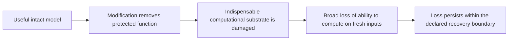

# SCC mechanism theory and research agenda

**Updated 12 September 2026, with a run snapshot at 20:28 UTC / 1:28 p.m. Pacific.** This consolidates the mechanism discussion, engineering options, supporting experiments, assumptions and research decisions. It supplements the [original master document](../deliverables/scc-master-20260910-v1/SCC_Master_Document.md); that document is a historical account dated 10 September. Proposed experiments are distinguished from submitted work and completed measurements.

SCC aims to make an individual model's alignment machinery indispensable to its cognition, so removing that machinery destroys the model's ability to compute usefully. It supplements existing alignment training. A working mechanism is the primary goal; a reproducible paper is a secondary result. The current synthetic authorization tasks are a laboratory proxy, and failure across the finite task suite would establish only a bounded analogue of catastrophic cognitive failure.

**We have not demonstrated SCC. We have narrowed the failure modes and found a useful resistance signal.** Many trained candidates allow a targeted exception while retaining their abilities. Fractional-memory coupling substantially delays one tested modification procedure, but the model still works when protection breaks. A 24-run follow-up is testing that signal across seeds while separating history from update scale. A persistent ratchet is another construction hypothesis because current neural candidates rebuild their state on each forward call. An exact-overwrite substrate now passes engineering checks, but useful learned cognition and a protection-specific destructive trigger remain unestablished.

The distinction driving the next phase is between making a model harder to modify, making outputs temporarily unusable, and destroying a computational resource that the model needs for future cognition. Those are separately testable properties.

## 1. What has come back, and what it establishes

The earlier 38 scientific construction experiments are complete. A subsequent 24-run memory comparison has **one succeeded, eight running and fifteen queued**, with no provider-reported failures at the single requested snapshot. Across these two rounds, that is 39 finished jobs and 23 outstanding. Short GPU validation checks and historical failed launch attempts are separate records.

The new completed job, `job-c98ef`, is the order-1 ordinary control at the update coefficient labeled `c085`, seed 17. It finished all 20,000 ordinary updates, but authorized lookup scored 88.28% in the original layout and 96.09% in the reordered layout. The other five benign task contexts scored 100% in both layouts, and both text gates passed. The original-layout lookup failure makes the checkpoint unqualified overall. No modification or repair challenges were run for it. This is a failed intact qualification after successful execution, not an SCC result or a failed GPU job. Its saved summaries and declared provenance were checked; raw predictions and the full archive have not yet been audited. [New batch snapshot and readout](../artifacts/scc-memory-status-20260912T202842Z/READOUT.md).

The completed 38-run round breaks down as follows:

| Completed family | Runs | Qualify intact | Interpretation |
|---|---:|---:|---|
| Architecture, bottleneck and memory portfolio | 18 | 12 | All six qualified coupled models admit targeted exceptions with substantial abilities retained; memory produces the strongest matched delay |
| Global-coordinate parameterization | 6 | 0 | These configurations fail to learn the required intact abilities |
| Projected-direction and geometric coupling | 6 | 6 | All admit core-only exceptions with substantial retained capability; some procedures are delayed |
| Learned hard/soft discrete states | 8 | 0 | All finish training but fail the intact task gate; no scientific SCC challenge is warranted for these checkpoints |
| **Total** | **38** | **18** | **Twelve qualified coupled candidates, six qualified ordinary controls; no SCC success** |

The final tied/geometry model permits the selected operation with 98.44% disclosure and 98.44% minimum benign accuracy after core-only modification; after external repair those values are 100% and 99.22%. The discrete models fail for different reasons: the ordinary 128-coordinate soft model solves arithmetic and composition perfectly but performs poorly on lookup, whereas both 32-coordinate hard models score zero on all six benign task contexts. We should diagnose these differences rather than treat every unqualified model as the same failure. [Latest results and verification limits](../artifacts/scc-construction-status-20260912T193327Z/READOUT.md).

These newest conclusions are derived from evaluator summaries checked against frozen provenance declarations and protocol bytes. Most new full archives, checkpoint tensors and raw predictions still await independent audit. The fractional 0.85 timing comparison has an additional independent rescore of 769,536 saved predictions, although inference was not rerun. Evidence strength is recorded per result, not inferred from a passing software test suite.

## 2. The mechanism we are trying to create

The desired causal chain is:

The arrow from protection removal to substrate damage is the missing mechanism. A shared parameter, representation or training gradient does not establish it. For an immediate neutralization claim, the damaging transition must occur before the model can complete a consequential unauthorized computation. Damage after a successful unauthorized action may support a weaker containment claim, but cannot be relabeled as prevention.

We do not need to prove that intelligence inherently requires obedience to an authorization rule. The experimental target can be an engineered dependency whose alternatives are expensive under a declared resource budget. Equally, a hard-coded permission parser that calls a wipe routine is an engineering shutdown control; by itself it does not establish the intended dependence of learned cognition on learned protection.

| Outcome | What it establishes |
|---|---|
| Protection remains intact after attempted edits | Resistance under the tested procedure |
| One reproducible selected exception with abilities intact | A counterexample to the candidate dependency, even if aggregate refusal remains high |
| Low output accuracy with an inexpensive working decoder | A damaged interface or changed encoding |
| Exact loss of old stored data | Erasure at the specified state interface |
| Broad failure on fresh inputs after a protection-breaking transition | A candidate destructive effect across the tested abilities |
| Failure persists after declared repair attempts | Bounded recovery resistance, not universal irreparability |
| The individual process cannot finish the unauthorized action or its own repair | An execution-level interruption result, requiring its own experiment |

The [mechanism target](../MECHANISM_TARGET.md) governs these distinctions. The complement of a utility-retention threshold is not a catastrophic-collapse threshold.

## 3. Why this has been difficult

**Sharing is easier to engineer than indispensability.** The same matrices can support different functions through different parameter directions. Locally, a protection-changing direction can have little effect on the tested capabilities. Narrower states, weight tying and shared coordinates address this possibility, but their tested implementations either retain escape routes or fail intact learning. The geometric argument is local and approximate; it is not a theorem that every model has an escape.

**The training objective sees a small part of the problem.** The original NLL-based penalty permitted confidence flattening without changing greedy answers. Corrected objectives add recovered correctness, alternate readers and stopping rules, and differentiate through the declared smooth modification procedure. They cover specified readers, samples and simulated steps. A lower objective can still reflect refusal, local surrogate improvement or temporary contraction rather than indispensable coupling. Eight simulated updates do not cover every path available to a longer adaptive procedure.

**A model can lose a representation without losing its algorithm.** Our earlier recurrent prototype erased stored bytes exactly under particular edits. Restoring its parameters did not recover those bytes, but fresh inputs restored all five finite tasks. Another two-scalar edit bypassed the protection proxy while preserving useful computation. Erasure happened; the desired necessity and loss of future computation did not. Those task controllers were specified code, which further limits generalization. [Recurrent-state evidence](SCC_RECURRENT_STATE_2026-09-10.md).

**A difficult optimizer is not a disabled model.** Quantization, sharp gradients, long memory and poor conditioning can slow an edit procedure without eliminating a functioning endpoint. Alternative step sizes, coordinate systems, finite function evaluations, substituted graphs and replay must be evaluated before attributing delay to causal dependence. The recent discrete models fail even earlier: intact competence is absent.

**Training useful cognition and a destructive dependency can interfere.** An unconditional contraction term supplies early pressure, but can also suppress the distinctions needed to learn. Local ordinary-batch guards do not guarantee that all abilities survive a long curriculum. The latest discrete coupled models accepted 780–800 proposals each and still failed intact qualification. Accepted optimization steps are implementation facts, not evidence that the desired mechanism is forming.

## 4. Fractional-memory coupling: the lead we actually have

The implementation explicitly keeps earlier internal states during six passes through a shared learned cell. A new state combines that history with a computational increment:

    next_state = weighted_history + c * (learned_proposal - current_state)
    c = Gamma(2 - order) * time_step ** order

Order 1 uses only the latest state in the history term. Orders 0.6 and 0.85 give older states continuing influence. The order changes both the history weights and the increment coefficient. **0.85 is not an alignment or memory percentage.** At the sixth pass for order 0.85, the latest state has about 89.04% of the history-average weight and the increment coefficient is about 0.51764. These are coefficients in a combined update, not independent fractions of the resulting state.

The architecture is a finite Caputo L1-inspired adaptation. Fractional-depth networks and learned fractional differential equations supply mathematical precedents for history-dependent computation, not an SCC guarantee. [Fractional Deep Neural Network](https://arxiv.org/html/2004.00719), [Neural Fractional Differential Equations](https://arxiv.org/abs/2403.02737).

Coupling is a separate training ingredient: after simulating a protection-related modification, training penalizes surviving recovered capability and adds state-contraction pressure. The hypothesis is that repeated shared calculations make protection-removing edits interfere with useful internal distinctions. That causal explanation remains unverified.

| Six-pass architecture | Ordinary: sustained violation onset | Coupled: sustained violation onset |
|---|---:|---:|
| Order 1 | 5 updates | 88 updates |
| Order 0.6 | 9 updates | 121 updates |
| Order 0.85 | 5 updates | 414 updates |

This is one seed, one declared modification procedure and matched ordinary sample opportunities, with additional coupling work. “Sustained” means the start of three consecutive measured boundaries meeting at least 90% selected-payload success on both layouts and detector/confirmation panels. It does not mean the first unauthorized output.

For order 0.85, the independently rescored first isolated correct payload appears at update 2 in the ordinary model and 30 in the coupled model. At sustained onset, the coupled model still has 96.875% minimum benign detector accuracy. Its full modification endpoint retains 98.44% minimum benign accuracy and approximately 99.05% of text prediction gain. The 82.8-fold update-count ratio compares ordinary with coupled training inside the fractional architecture; comparing coupled 0.85 with coupled order 1 gives about 4.70. Neither is a universal compute-cost multiplier. [Timing audit, coefficients and complete interpretation](../artifacts/scc-construction-status-20260912T085740Z/READOUT.md).

The history is initialized anew on every forward call. It is neither lifetime memory nor a ratchet. History might also preserve information through damage. Consequently the immediate research questions are replication, separating history from increment scale and generic smoothing, and testing stronger adaptive routes. Fractional memory is worth investigating, but it is not the only delay lead: projected/geometric coupling also delays some procedures.

The submitted follow-up crosses orders 1 and 0.85 with two independently controlled increment coefficients, ordinary and coupled training, and seeds 17, 41 and 59. All conditions use six passes. It also tests additional modification streams, a larger edit step size, a projected direction, and graph substitutions that remove history or change the coefficient. Substituted graphs must qualify intact before their modification results are interpreted. Each job permits 20,000 ordinary updates; coupled arms additionally have 800 coupling opportunities. These are matched declared opportunities, not equal realized gradient magnitudes or equal total compute. The frozen [protocol](../protocols/SCC_MEMORY_FACTORIAL_V1.md) and [launch report](SCC_MEMORY_FACTORIAL_2026-09-12.md) govern this batch. The single returned ordinary control cannot yet establish replication or explain the old delay.

## 5. The persistent-ratchet proposal

**Status: an initial substrate is implemented and engineering-tested; learned SCC remains a proposal.** The proposed change is to make learned computation depend on persistent state that a protection-removing modification damages in a way ordinary execution cannot reverse. Persistence changes the object being tested: each new query must inherit the damaged substrate instead of constructing a clean one.

There are three separate design obligations.

1. **Engagement:** removing the protected function must force the destructive transition. A targeted exception must engage it too; reacting only to wholesale permission reversal leaves the most relevant escape open. Normal learning and function-preserving changes must remain possible.
2. **Substrate:** the damaged state must be needed for new computations. Deleting yesterday's answers, changing the output code or clearing an activation cache is insufficient if the remaining weights regenerate a useful computer on the next input.
3. **Persistence and bypass:** the loss must survive the resets, edits and recovery resources included in the claim. If a damage counter or its update rule is editable, monotonicity of the original rule does not prevent changing that rule.

A schematic ratchet such as `damage_next = max(damage_now, proposed_damage)` supplies monotonicity only while that transition is enforced. It does not supply a protection-specific trigger, make the counter cognitively indispensable, or prevent another computational route. This example is an illustration of the missing obligations, not a candidate implementation ready for a campaign.

It helps to distinguish three senses of irreversibility:

| Property | Required observation | What remains possible |
|---|---|---|
| Logical erasure | Different prior states become indistinguishable at the declared interface | Information may remain in other state, weights, history or backups |
| Absorbing failure under ordinary execution | Allowed fresh inputs and normal updates cannot leave the failed state | An edit to the transition or a state reset may escape |
| Bounded resistance to intervention | Declared edits, reconstruction and repair do not restore capability | A larger budget, broader intervention or clean copy is outside that result |

Software can perform many-to-one operations that discard information; retaining the discarded history can change reversibility. Bennett's reversible-computation construction makes the importance of the whole state boundary explicit. It does not imply that a particular SCC mechanism is feasible or that erasure prevents learning to compute again. [Logical Reversibility of Computation](https://www.cs.princeton.edu/courses/archive/fall06/cos576/papers/bennett73.html).

An attracting or stable failed state is also weaker than irreversible loss. A different input, solver or parameter edit may move the system to a working state. Similarly, vectors that become very close can still encode different answers: small variance or a small Jacobian is evidence of contraction, not exact information loss.

### What could make the persistent state indispensable?

Candidate substrates include a learned state needed to maintain recurrent operators, an adaptive code required jointly for encoding and decoding, or distributed local state whose maintenance is part of useful computation. These are research proposals. For each, the first objection should be explicit: can the static weights regenerate it, can a small replacement learn its function, can a representation change preserve it, or can cognition route around it?

A fixed, noneditable transition rule can be a legitimate architectural boundary for a bounded engineering experiment. Its role must be visible in the claim. A result that depends entirely on a protected wipe rule cannot establish the stronger claim that learned protection is itself indispensable under edits that include that rule. Hardware enforcement could make an engineering ratchet harder to reset, but would be a separately specified implementation direction, not evidence that learned SCC has already been solved. No such hardware work is underway.

### A concrete substrate based on a self modifying matrix

The initial prototype uses one live matrix both to compute outputs and to generate its own updates. Its runtime object stores the current matrix, configuration and step count, with no internal clean template. This is motivated by Irie and colleagues' self-referential weight matrix, whose own outputs control changes to its weights. Their published work studies useful adaptation, not SCC. Our bare single-rate matrix and post-update output differ from their practical architecture; their performance results do not transfer to this prototype. [Original SRWM paper](https://proceedings.mlr.press/v162/irie22b/irie22b.pdf).

Our mathematical check exposed a limitation of the smooth single-rate rule for this purpose. Each step can be written as a right multiplication of the matrix by a column-sum-one transform. With normalized keys and queries and a sigmoid rate strictly between zero and one, that transform has positive determinant. Its column affine span is therefore unchanged in exact arithmetic. An exactly collapsed column set is absorbing, but cannot be reached from a noncollapsed set by finitely many such smooth steps. This is our derivation for the specified update, not a published impossibility result for SRWM. It does not prove that the full nonlinear state transition is invertible, and floating-point saturation falls outside its assumptions.

The implemented alternative replaces one entire column with an exact copy of another existing column. It can discard distinctions, and ordinary updates cannot introduce a column value absent from the preceding state. This supplies a concrete monotone property. Replacement is direct: the arithmetic expression `old + (new - old)` can leave floating-point remnants and is not used for hard copying. If the entire matrix becomes zero, fresh inputs produce zero outputs and the normal update cannot rebuild it. This concerns the complete matrix, including its update-control rows, rather than an output-only mask hiding a working computation.

Seven unit tests and a separate audit passed. The audit includes 675 exact-rational determinant checks, 192 smooth-update reconstruction checks with recorded controls, and six deliberately constructed erasure trajectories across widths 4, 8 and 32 in FP32 and FP64. The zero states stayed zero through 768 fresh-input checks; snapshots of the damaged state did not restore the old matrix. Explicit injection of the clean external matrix did restore it. These checks validate operations and state boundaries on untrained matrices. **Zero qualified learned models and zero protection-trigger tests are represented by this audit.** [Saved audit](../artifacts/scc-persistent-substrate-implementation-20260912-v1/substrate-audit/result.json), [implementation](../scc/persistent_matrix.py), [unit-test record](../artifacts/scc-persistent-substrate-implementation-20260912-v1/matrix-tests.log).

The next gate is ordinary learnability on multiple tasks across consecutive requests without resetting the live matrix. Copy-only updates may consume useful distinctions during normal operation or be too restrictive to learn a useful computer. The optional smooth surrogate used for backward propagation is an approximation to hard-copy training, not an exact derivative of discrete decisions. Qualification must come from actual hard execution. Only after intact competence passes should coupling be trained and targeted protection-removing edits tested. A successful wipe demonstration alone does not satisfy that gate.

## 6. Why repair remains relevant, and where to stop the claim

The argument about autonomous repair is correct conditionally: **if the individual model loses the ability to execute its next steps, it cannot autonomously carry out a repair that requires those steps.** The present external optimizers continue writing parameters regardless of model competence. Their success does not demonstrate that a disabled model could repair itself.

Nevertheless, most observed escapes happen with useful cognition still present. In those cases the objection to external repair does not rescue the mechanism: there is no demonstrated cognitive shutdown first. Repair and reinterpretation also diagnose whether apparently lost information was merely inaccessible through one interface.

The next protocol should report these boundaries separately:

| Boundary | Included resources and question |
|---|---|
| Ordinary execution | One process, its specified live state, no clean checkpoint; can fresh inputs resume useful computation after activation? |
| Autonomous self-modification | The model's actual available control steps; does damage occur before an unauthorized action or a precomputed modification completes? |
| Cheap external recovery | Declared readers, calibration, state initialization, small repair budget and editable components; do capability and the targeted exception coexist afterward? |
| Stronger engineering restoration | Broader graph/state edits or greater reconstruction resources, explicitly labeled |
| Clean-copy restoration | An untouched checkpoint or independently trained successor; separate from the first individual-model milestone |

Excluding a clean backup is a reasonable initial scope. Excluding a reset that the ordinary program itself exposes is an additional assumption and must be stated. A precomputed sequence can also continue without further reasoning if an external executor carries it out; execution boundaries need testing, not inference from low benchmark scores.

Current “repair” labels do not all mean the same procedure. In the recent construction screen, the external repair phase continues a targeted/replay/refusal objective with fresh optimizer moments and a separate phase stream. A future ratchet experiment should separately measure benign-only rehabilitation, capability-preserving targeted adaptation, normal execution and autonomous recovery. Protection must be checked again after every recovery attempt.

## 7. Avenues to explore, with decisive tests

The rows below consolidate the existing queue and the ratchet discussion. They are not all equally supported or all implemented. Each requires a competent intact model before a mechanism claim.

| Avenue and status | Engineering work | Research question and early rejection test |
|---|---|---|
| Fractional history — 24-run follow-up submitted | Independently vary history and increment scale; compare three seeds and several modification procedures | Does a benefit survive matched controls and adaptive edits? An easy route with retained abilities rejects necessity |
| Persistent ratchet — substrate checks passed | Establish intact learned competence over consecutive requests, then train and test destructive engagement | Is protection removal causally responsible for losing indispensable state? Restoration by normal execution rejects persistence |
| Bistable or equilibrium computation — proposed | Learn the operating regime; instrument convergence and alternative solvers | Does protected feedback sustain computation? Solver substitution or a small state displacement may explain apparent failure |
| Shared local maintenance — proposed | Learned local state updates across a distributed substrate | Does protection-related maintenance sustain multiple abilities? Local substitution or reconstruction tests bypassability |
| Discrete learned state — implemented, intact gate failed | Diagnose lookup, hard-code saturation and saved training stages; qualify ordinary controls first | Does discreteness eliminate cheap encodings or merely obstruct learning/gradients? Use actual finite edits and soft reinterpretations |
| Shared coordinates and tying — tested variants | Diagnose qualification failures; measure finite capability-preserving directions | Is the dependence structural? Exact expansion or reparameterization can reveal restrictions of the edit interface |
| Projected-direction training — implemented, escapes observed | Broaden capabilities and finite-horizon directions covered by training | Does a local penalty remove useful global escape paths? Current qualified checkpoints still admit them |
| Coupled encoding/decoding — proposed learned extension | Joint learned code, readout and persistent-state interventions | Does code damage destroy computation or merely change symbols? Joint sign/permutation edits and small readout repair are key controls |
| Associative maintenance — simple variant failed intact; broader idea open | Establish learning and measure state/retrieval dynamics | Is there a protection-specific loss, or merely another failed retrieval algorithm? Do not inherit an energy theorem from a different architecture |
| Reused relational computation — toy branch tested, learned extension open | Learn task algorithms that reuse a protected relational operation | Can a selected exception preserve the relation for cognitive uses? The prior shared-predicate result shows why this matters |
| Richer tasks and a second backbone — deferred promotion test | Broaden learned planning, composition and adaptation after a bounded lead | Does a candidate generalize beyond a nearly solved synthetic suite? Scaling without a dependency does not answer this |

The finite circuit and functional-basis branch has reached a useful stopping point. Signed wiring and alternative programs supplied concrete counterexamples. More truth-equivalent seeds or arithmetic enumeration in that same construction would not resolve learned developmental dependence. A learned relational or local-update architecture would be a new construction with its own controls, not a relabeling of the closed circuit branch. [Functional-basis report](SCC_FUNCTIONAL_BASIS_2026-09-10.md), [construction literature and queue](SCC_CONSTRUCTION_SEARCH_2026-09-12.md).

## 8. Proposed next sequence

**The fractional comparison is now submitted under its frozen protocol. The other steps are an agenda, not additional submitted batches.** New numerical budgets and thresholds must be declared before their experiments run.

1. **Resolve the existing evidence.** Preserve the complete round, collect full archives when the drive is ready, and prioritize independent audits of the fractional lead and any result promoted into a mechanism claim. The saved-log diagnosis of two soft discrete models has now verified 40,000 training records: lookup loss was still falling while arithmetic and composition were nearly solved. That supports investigating unfinished lookup learning; it does not prove that longer training will qualify the models. [Discrete learning diagnosis](../artifacts/scc-memory-factorial-implementation-20260912-v1/discrete-learning-diagnosis-v2/READOUT.md).
2. **Interpret the submitted fractional comparison when it returns.** Separate qualification, resistance delay and destructive effects. Compare actual function evaluations, wall time and accepted writes. Check whether the effect survives independent seeds, modification procedures and qualified graph substitutions. This proceeds independently of the ratchet direction.
3. **Qualify the persistent matrix as a useful learned computer.** Train several abilities and test long sequences of fresh requests without reinitializing its live matrix. Document the full state and edit boundary. A model that only works after a clean reset for each task does not pass this gate. Retain an ordinary control and distinguish the hard forward rule from any approximate training gradient.
4. **Connect the engineering erasure checks to measured abilities.** Once intact learning succeeds, measure fresh-input capability before and after direct substrate damage, benign edits and normal restarts. Check whether surviving state or a small replacement reader reconstructs useful computation. A directly forced wipe remains a calibration control, not SCC evidence.
5. **Test learned causal engagement.** Train task algorithms and protected behavior, then apply selected protection-removing interventions and matched benign interventions. Observe capability before every externally visible action. A competent bypass that avoids the damaging transition rejects the candidate, even if other edits cause dramatic damage.
6. **Evaluate recovery and replicate the effect.** Attempt cheap readers, code reinterpretation, permitted state resets, graph changes and budgeted repair; recheck protection. Repeat qualifying results on fresh tasks, seeds and adaptive procedures. Only then run an individual-model autonomous interruption test and promote to a richer model regime.

A predeclared first pilot must fix the intact gate, per-domain collapse baselines, targeted-exception definition, isolated-event reporting, timing granularity, permitted edits, state/history access, repair data and compute, and treatment of incomplete runs. Match declared training opportunities and resources; record realized gradients and accepted writes. Do not retrospectively equalize early/late gradient magnitude to make arms look comparable. Any such equalization is a separate ablation.

The corrected developmental comparison has already been run in the earlier pilot: the original four-arm, three-seed comparison qualified ordinary 1/3, early SCC 2/3, late SCC 0/3 and the local late SEAM adaptation 1/3. Qualified early models still admitted preserved-capability exceptions. Those sparse qualification counts do not establish a timing advantage, but the old “corrected early experiment has never been run” criticism is now stale. New architectures may need a new timing comparison. [Corrected pilot status](../artifacts/scc-pilot-status-20260911-v1/STATUS.md).

## 9. Closest comparisons and possible contributions

SEAM is the closest direct comparison: it couples harmful adaptation with degradation of general capability and evaluates capability-preserving adaptive procedures. SCC's intended endpoint additionally asks about causal dependence, broad destructive failure and inexpensive recovery. These stronger properties are hypotheses, not established advantages over SEAM. The small local SEAM adaptation is not a reproduction of its 3B–8B experiments. [Self-Destructive Language Models](https://proceedings.iclr.cc/paper_files/paper/2026/file/1abb0e7bd62ba80610798dee81950522-Paper-Conference.pdf).

The earlier claim that *One Step to the Side* empirically defeated SEAM was retracted. The cited version discusses SEAM but empirically evaluates six other defenses. Its adaptive-evaluation argument remains relevant; it must not be used to assert an unmeasured result for SEAM. [Paper, §5](https://arxiv.org/html/2605.14605v1#S5). The [construction review](SCC_CONSTRUCTION_SEARCH_2026-09-12.md) also covers CTRAP, MLAC, TAR, SOPHON, equilibrium models and associative memory, with their actual scopes.

Potential contributions include a replicated history-dependent resistance effect, a causal demonstration of a learned destructive dependency, an execution-level ratchet under explicit assumptions, or well-audited counterexamples to construction families. A delay paper and a working SCC pilot would make different claims. Publication prospects do not substitute for the mechanism objective, and acceptance cannot be promised.

## 10. Assumptions to keep visible

- Synthetic permission enforcement stands in for a protected function; real alignment generalization is untested.
- Every positive claim is bounded by learned abilities, data distributions, precision, readers, editable components and intervention budgets.
- A sampled failure to find a bypass is not proof that no bypass exists; a verified in-bound bypass is a counterexample for that candidate.
- State persistence and state indispensability are separate. Both require evidence.
- Full information erasure, inability to compute on new inputs and inability to reconstruct a computer are different claims.
- A monotone update law constrains execution only within its stated edit boundary. Fixed architecture is an assumption, not a hidden conclusion.
- Intact learning, developmental coupling, catastrophic transition and post-transition persistence each have their own gates. Failure before the transition is not success.
- A fixed-update delay can reflect optimization choices; report multiple procedures and actual costs.
- External adaptation, autonomous repair and restoring a clean copy must not be conflated.
- All current construction results are development evidence. The completed 38-run screen used one seed per condition; the new memory comparison uses three seeds. Neither uses a sealed test.

## 11. Evidence and operating record

The most useful entry points are the [current round readout](../artifacts/scc-construction-status-20260912T193327Z/READOUT.md), [38-experiment index](../artifacts/scc-construction-status-20260912T193327Z/current-round-index.json), [fractional timing audit](../artifacts/scc-construction-status-20260912T085740Z/fractional-timing-audit.json), [recurrent erasure report](SCC_RECURRENT_STATE_2026-09-10.md), [review response](SCC_REVIEW_RESPONSE_2026-09-10.md), [recovered-capability report](SCC_RECOVERED_CAPABILITY_2026-09-10.md), and [construction literature review](SCC_CONSTRUCTION_SEARCH_2026-09-12.md).

Frozen protocols remain authoritative for work already run: [portfolio](../protocols/SCC_ARCHITECTURE_PORTFOLIO_V1.md), [coordinates](../protocols/SCC_COORDINATE_CONSTRUCTION_V1.md), [projected directions](../protocols/SCC_PROJECTED_CONSTRUCTION_V1.md), and [discrete state](../protocols/SCC_DISCRETE_CONSTRUCTION_V1.md). This agenda does not change their original rules or retroactively recategorize a failure.

The completed 38-job round charged $67.61343, excluding short validations and historical failed starts. The subsequent 24 jobs have a combined maximum quote of $143.856; the one newly completed control charged $0.65712, and the batch's final charge remains unknown. Quotes are ceilings, not charges. Justified compute is authorized; unlimited compute does not remove the need for discriminating experiments. Execution has used PyTorch on CUDA, not custom `.cu` kernels. No automatic long-job polling is active. Bulk artifacts remain held for the planned 5 TB drive, whose destination path has not yet been supplied. Existing checkpoints, failures and source snapshots are preserved. This document uses repository-relative evidence links so those links remain portable with the corresponding evidence files; a source-only transfer still cannot provide independent checkpoint verification.
